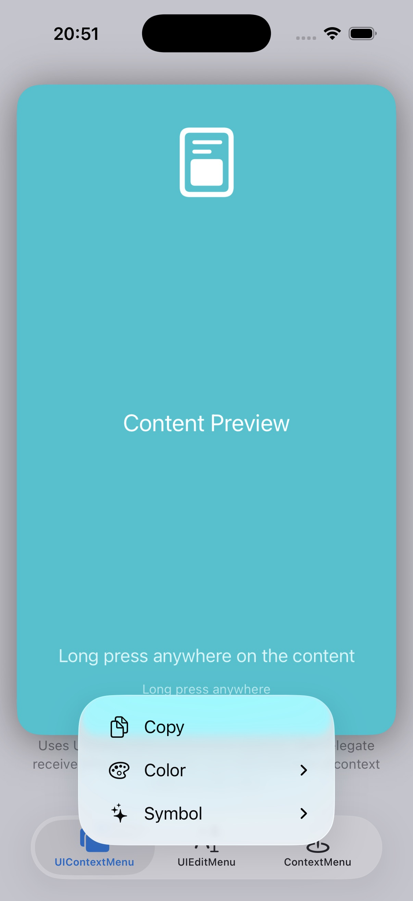
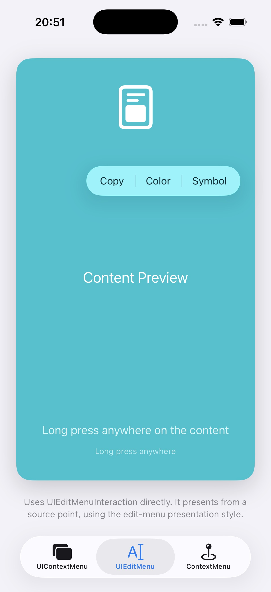
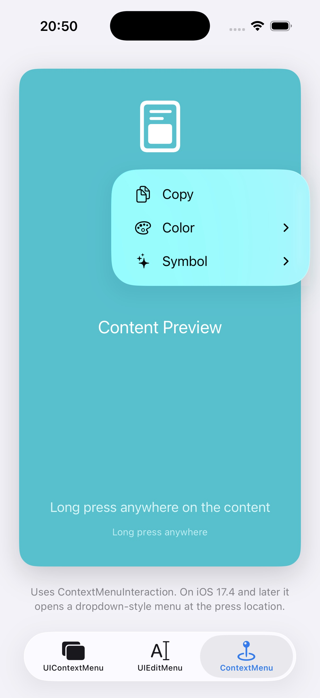

[](https://github.com/nicklockwood/ContextMenu/actions/workflows/build.yml)
[]()
[](https://developer.apple.com/swift)
[](https://opensource.org/licenses/MIT)
[](https://mastodon.social/@nicklockwood)

- [Introduction](#introduction)
- [Motivation](#motivation)
- [Installation](#installation)
- [Usage](#usage)
- [Example](#example)
- [Credits](#credits)


# Introduction

**ContextMenuInteraction** is a small UIKit `UIInteraction` for presenting a `UIMenu` from a long press anywhere inside a view.

It is intended for content surfaces such as canvases, previews, editors, maps, and scene views where the menu should be anchored to the exact pressed point instead of being tied to a visible `UIButton`, while still using the standard dropdown menu style.


# Motivation

UIKit makes button menus straightforward: set `showsMenuAsPrimaryAction`, attach a `UIMenu`, and the system presents a dropdown-style menu with top-level actions arranged vertically. That presentation is often the right fit for app commands.

`UIContextMenuInteraction` solves a different problem. It is easy to attach to arbitrary content and its delegate receives the interaction location, but the menu is still presented as a context-menu interaction for the whole view. That can be a poor fit when the desired behavior is simply to open a button-style dropdown menu at the point the user pressed.

A drawing canvas, document preview, or 3D scene often needs a contextual menu at the point the user touched, with the same dropdown presentation users see from a button menu. Adding hidden buttons throughout the content is brittle.

`ContextMenuInteraction` packages the workaround into a reusable interaction. On iOS 17.4 and later it presents a standard dropdown menu through a temporary invisible button positioned at the press location. On iOS 16 and later it falls back to `UIEditMenuInteraction`, which can present from a source point but uses the system edit-menu presentation style.

  

# Installation

ContextMenu is packaged as a dynamic framework that you can import into your Xcode project. You can install this manually, or by using Swift Package Manager.

**Note:** ContextMenu can be built into apps targeting iOS 14 or later, or Mac Catalyst 14 or later, but menus are only displayed on iOS 16 and later. Full dropdown-style behavior requires iOS 17.4 or later; on iOS 16 through 17.3 the library falls back to `UIEditMenuInteraction`.

To install using Swift Package Manager, add this to the `dependencies:` section in your Package.swift file:

```swift
.package(url: "https://github.com/nicklockwood/ContextMenu.git", .upToNextMinor(from: "1.0.0")),
```


# Usage

Create a `ContextMenuInteraction` with a menu provider, then add it to any `UIView`:

```swift
import ContextMenu
import UIKit

let canvasView = UIView()

canvasView.addInteraction(ContextMenuInteraction { location in
    let menu = UIMenu(children: [
        UIAction(title: "Copy", image: UIImage(systemName: "doc.on.doc")) { _ in
            copyItem(at: location)
        },
        UIAction(title: "Delete", image: UIImage(systemName: "trash"), attributes: .destructive) { _ in
            deleteItem(at: location)
        },
    ])

    return ContextMenuInteraction.Configuration(menu: menu)
})
```

Return `nil` when there is no menu for the pressed location:

```swift
view.addInteraction(ContextMenuInteraction { location in
    guard let item = item(at: location) else {
        return nil
    }
    return ContextMenuInteraction.Configuration(menu: menu(for: item))
})
```

You can call `presentMenu(at:)` directly if another gesture or selection system decides when the menu should appear:

```swift
interaction.presentMenu(at: CGPoint(x: 80, y: 120))
```


# Example

Open `ContextMenu.xcodeproj` and run the `ContextMenuExample` target on an iOS simulator, device, or Mac Catalyst destination. The example attaches the interaction to an entire content view, so long-pressing anywhere on the card presents a menu anchored to that point.


# Credits

The ContextMenu library was created by [Nick Lockwood](https://github.com/nicklockwood).
