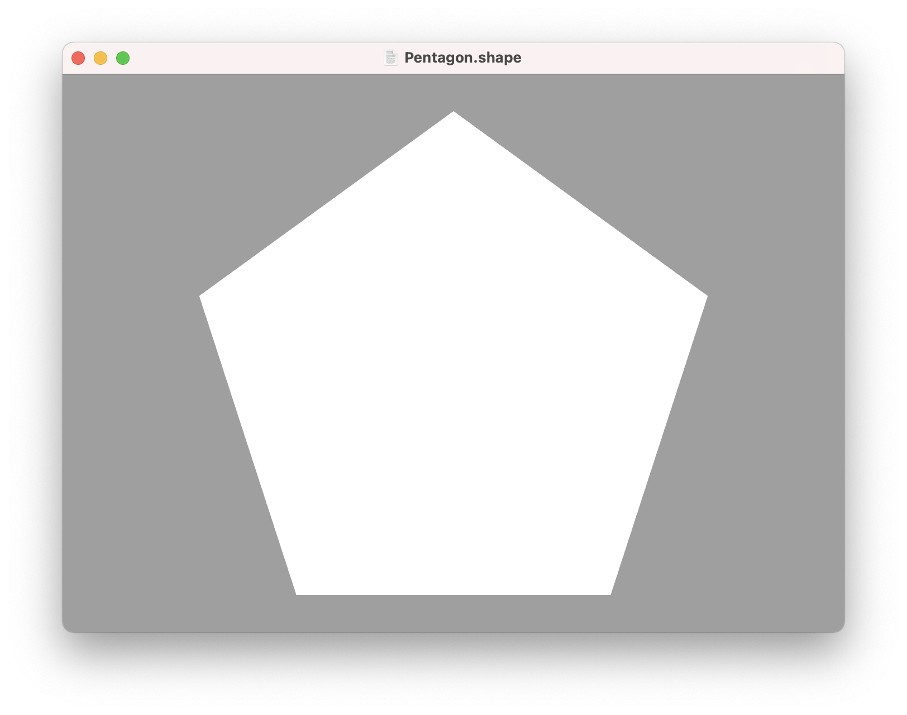
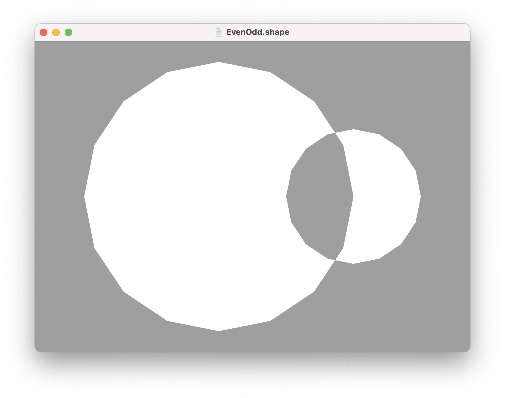
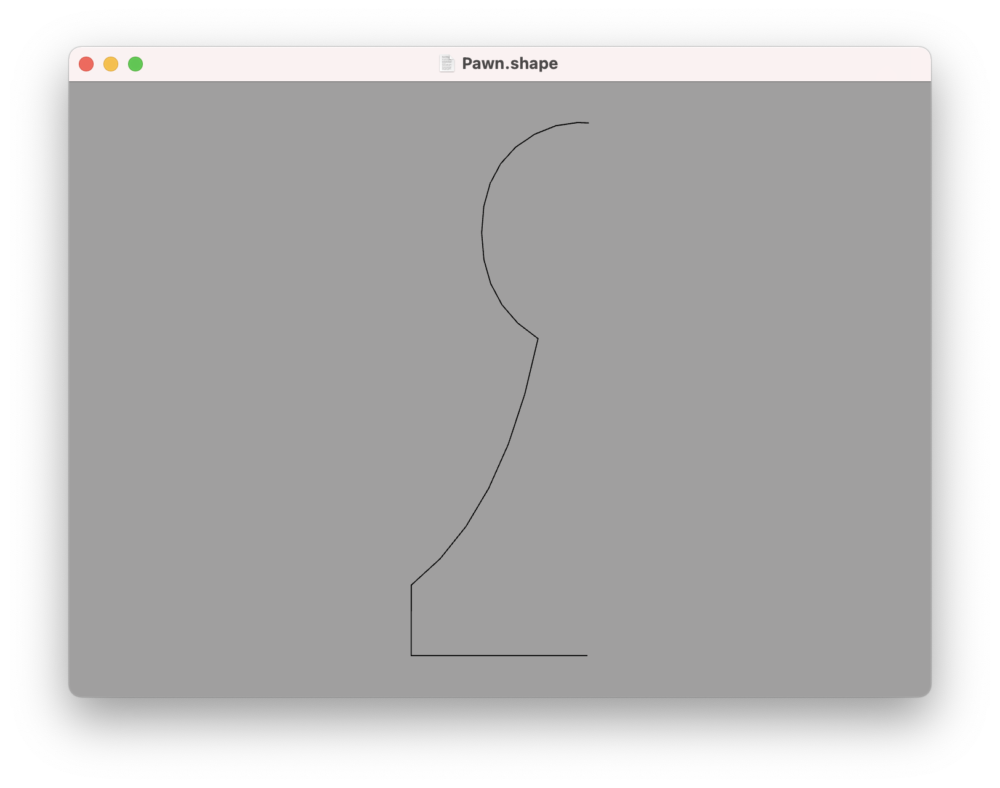
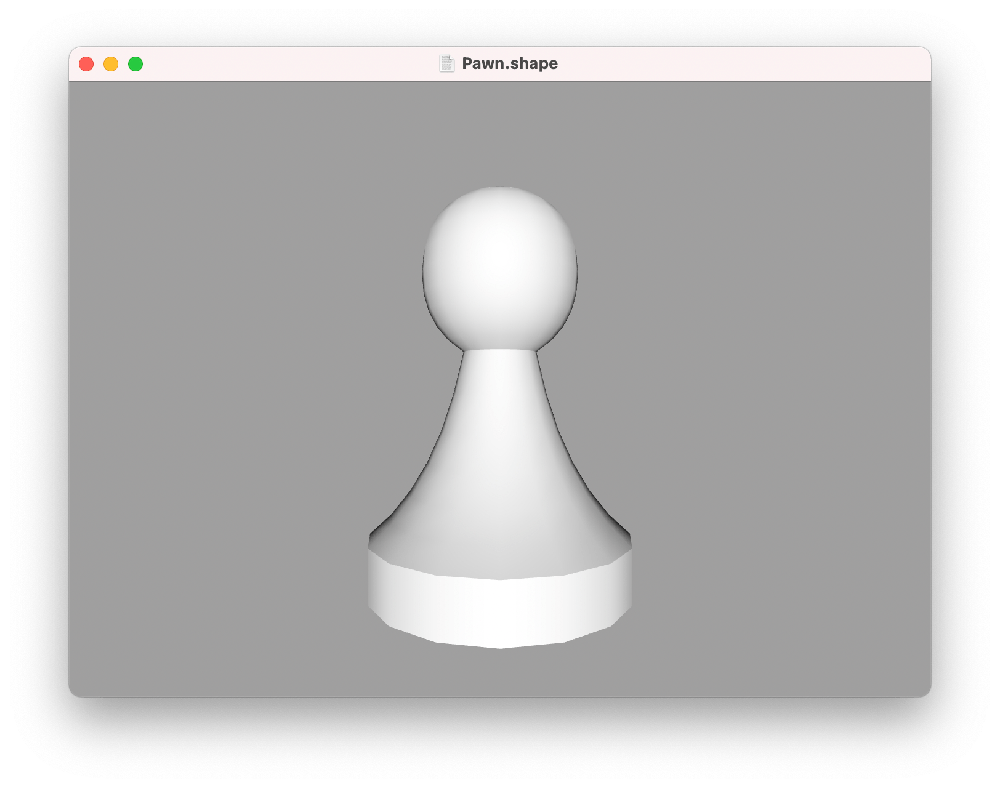
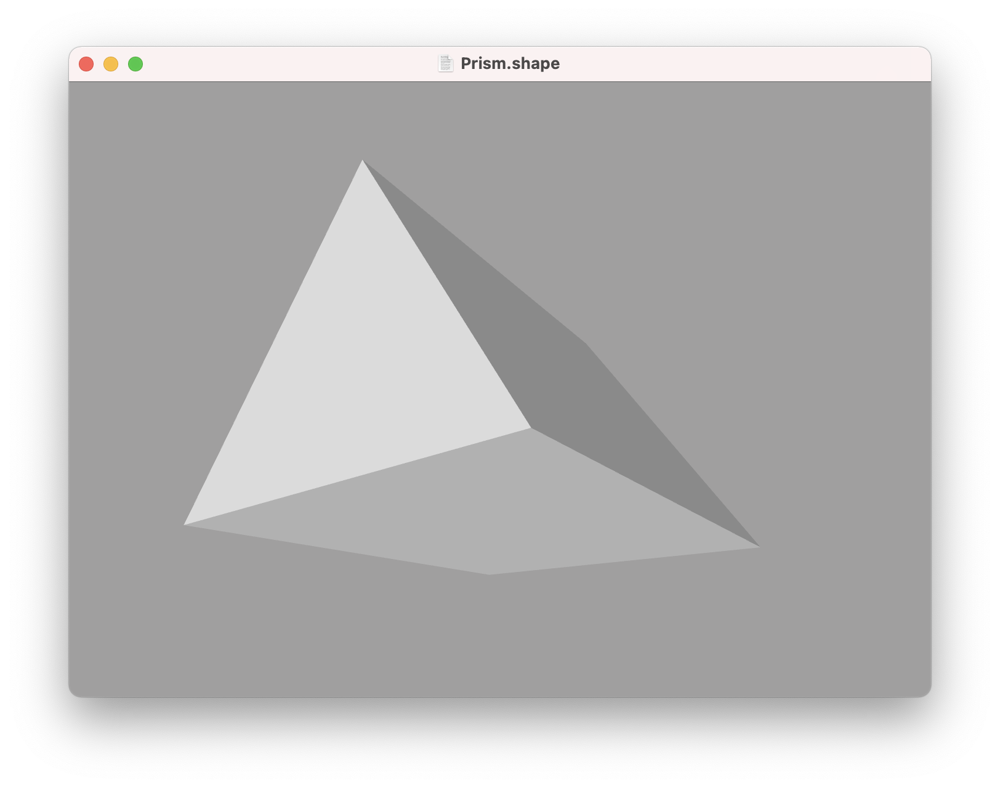
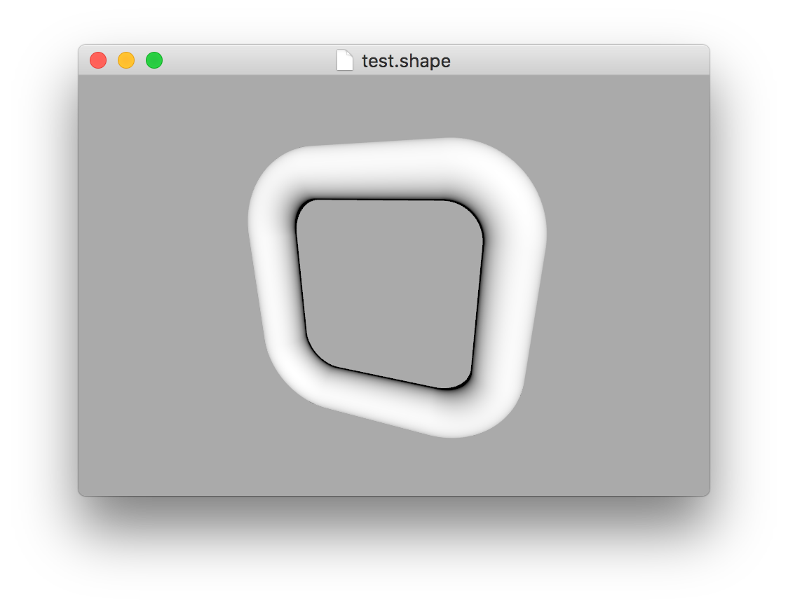
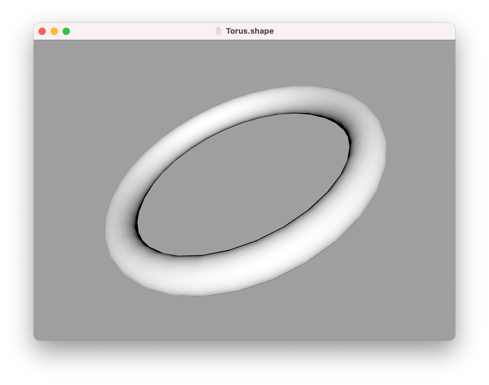
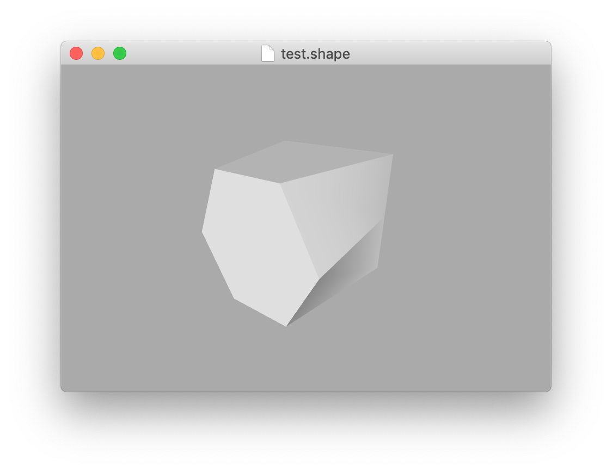

Builders
---

We explored some basic 3D shape types in the [primitives](primitives.md) section, but the real power of ShapeScript comes from the ability to define custom shapes.

In the [paths](paths.md) section we looked at how to define custom shapes using paths. ShapeScript has a variety of built-in commands for creating 3D shapes from paths, called *builders*:

## Fill

The most basic shape builder is the `fill` command, which creates a filled polygon from a path. Using the pentagon path we defined earlier, we can use `fill` to create a solid pentagon:

```
fill path {
    for 0 to 5 {
        point 0 1
        rotate 2 / 5
    }   
}
```



Unlike a path, a filled shape can have a color and texture, but it has zero thickness.

If a path contains multiple overlapping sub-paths, they will be filled using the [even-odd rule](https://en.wikipedia.org/wiki/Even–odd_rule). For example, the [overlapping circles](paths.md#nested-paths) path would be filled like this:

```swift
fill path {
    circle
    translate 0.5
    scale 0.5
    circle
}
```



## Lathe

The `lathe` command creates a 3D shape from a 2D path by revolving it around the Y axis.

To use `lathe`, you must first define a suitable path. For example, the following code defines the *profile* (one half of the outline) of a chess piece:

```swift
path {
    curve 0 0.78
    curve -0.15 0.7
    curve -0.15 0.5
    point -0.07 0.45
    curve -0.12 0.2
    point -0.25 0.1
    point -0.25 0
    point 0 0
}
```



When passed to the `lathe` command, the path creates a solid 3D model:

```swift
lathe path {
    curve 0 0.78
    curve -0.15 0.7
    curve -0.15 0.5
    point -0.07 0.45
    curve -0.12 0.2
    point -0.25 0.1
    point -0.25 0
    point 0 0
}
```



As with other curved shapes such as the `sphere` and `cone`, the smoothness of the lathed surface can be controlled using the `detail` command.

The path describing the profile of the lathed shape was in this case open-ended. Since the ends meet at the Y axis anyway, the resultant shape will still be closed. Open paths that do not touch the axis will produce a hollow shape with visible holes.

Lathed paths must lie flat on the XY plane, and  be positioned entirely to one side of the Y axis. Any points on the path with a non-zero Z coordinate will be flattened, and parts of the path that cross the Y axis will be clipped before lathing.

## Extrude

The `extrude` command extrudes a 2D path along the Z axis. The path therefore represents a cross-section of the final shape. The default extrusion distance is 1 unit, but it can be overridden using the `size` option or relative `scale` command (as described in [transforms](transforms.md)).

In the following example, `extrude` is used to create a triangular prism:

```swift
extrude {
    size 1 1 2 // increase extrusion distance to 2 units
    path {
        for 0 to 3 {
            point 0 1
            rotate 2 / 3
        }
    }
}
```



You can also extrude a shape *along* another path using the `along` option. In the following example, a circle is extruded along a rounded rectangle:

```swift
extrude {
    circle
    along roundrect {
        size 5
    }
}
```



## Loft

The `loft` command is similar to `extrude`, but instead of taking a single cross-section path and extruding it by a fixed distance, `loft` accepts multiple cross-sections and then joins them together to form a solid shape.

For `loft` to work correctly, the specified paths must *not* all be located on the same plane, otherwise the resultant shape will be flat. You can either provide non-zero Z values for your path points, or use the `translate` command to space out your paths.

For example, the following code produces a prism equivalent to the extrusion example above:

```swift
loft {
    // triangle 1
    path {
        for 0 to 3 {
            point 0 1
            rotate 2 / 3
        }
    }

    translate 0 0 2

    // triangle 2
    path {
        for 0 to 3 {
            point 0 1
            rotate 2 / 3
        }
    }
}
```

You can also apply rotations and scaling between cross sections, to create bends or curves. For example, the following code creates a torus:

```swift
define steps 32
define radius 1 // radius of ring

loft {
    for 0 to steps {
        circle { size 0.25 }
        rotate 0 0 -1/steps
        translate 0 0 (2 * pi * radius / steps)
        rotate 0 0 -1/steps
    }
}
```



However, the real power of the `loft` command comes from the fact that you can use *different* cross-sections, and the resultant surface will be interpolated between them. For example, here is a shape whose cross-section is square at one end and hexagonal at the other:

```swift
loft {
    // hexagon
    path {
        point -0.5 1
        point -1 0
        point -0.5 -1
        point 0.5 -1
        point 1 0
        point 0.5 1
        point -0.5 1
    }
    
    translate 0 0 2
    
    // square
    path {
        point -1 1
        point -1 0
        point -1 -1
        point 1 -1
        point 1 0
        point 1 1
        point -1 1
    }
}
```



You may notice that in the code above, the square face is defined using six points instead of four (well, seven actually, but the last point just closes the loop). In order to interpolate smoothly, it is important that all cross-sections have the same number of points. This may mean adding redundant points in some cases.

---
[Index](index.md) | Next: [Constructive Solid Geometry](csg.md)
