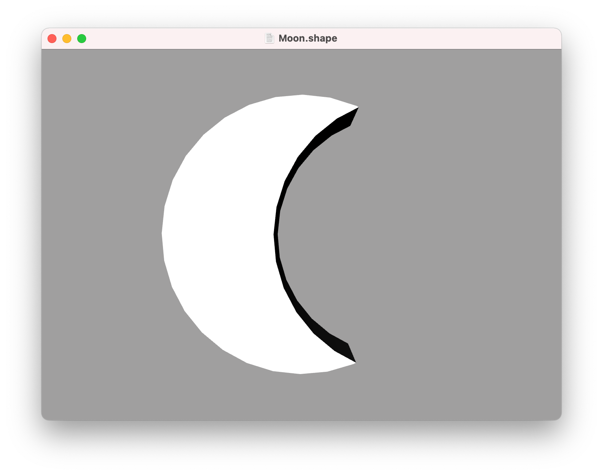
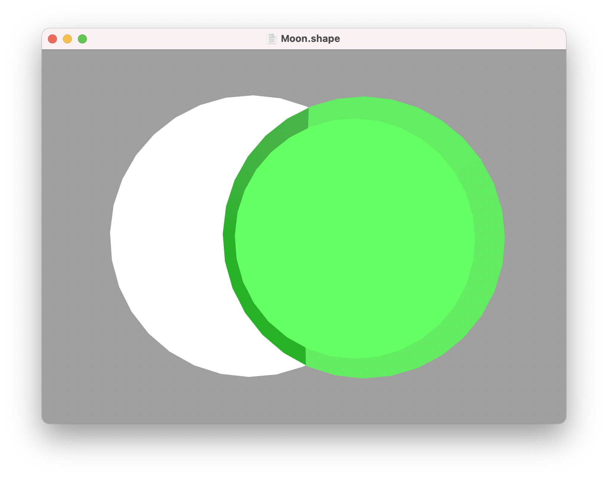

Debugging
---

When using the [constructive solid geometry](csg.md) operations it can sometimes be difficult to visualize the individual components that comprise a given shape. In the example below, a moon shape is created by subtracting one cylinder from another:

```swift
difference {
    cylinder {
        size 1 0.2
    }
    
    // cylinder not visible in viewer
    cylinder {
        position 0.4
        size 1 0.2
    }
}
```



Because the second cylinder is subtracted from the first, we can't actually see it, which means we can't [select it](getting-started.md#debugging-and-selection) to get information about it, or properly understand its shape. To solve this, we can use the `debug` command:

```swift
difference {
    cylinder {
        size 1 0.2
    }
    
    // debug command makes cylinder visible
    debug cylinder {
        position 0.4
        size 1 0.2
    }
}
```

This makes the cylinder visible in the editor and allows it to be selected like any other shape.



## Logging

When creating complex scripts, it can sometimes be difficult to understand what's happening in the code. To help you debug your scripts, you can use the `print` command:

```swift
print 5 + 6

print "some text"

print someValue
```

The `print` command accepts one or more arguments of any type. You can use this to intersperse values and text labels for example:

```swift
print "width =" width

print "x:" x "y:" y
```

Printed values are displayed in a console area below the scene. The console can be resized and scrolled to show as much text as you need.

---
[Index](index.md) | Next: [Import](import.md)
