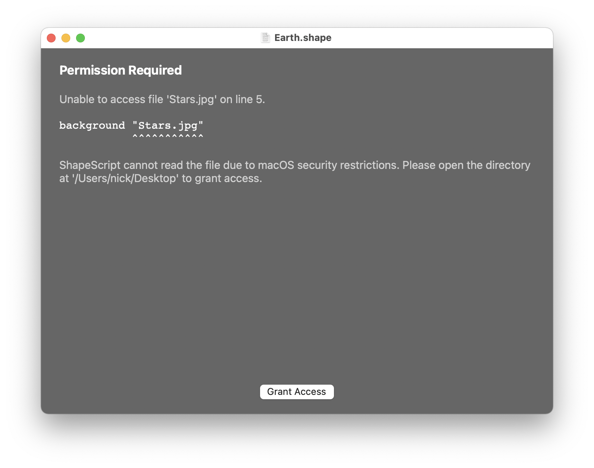
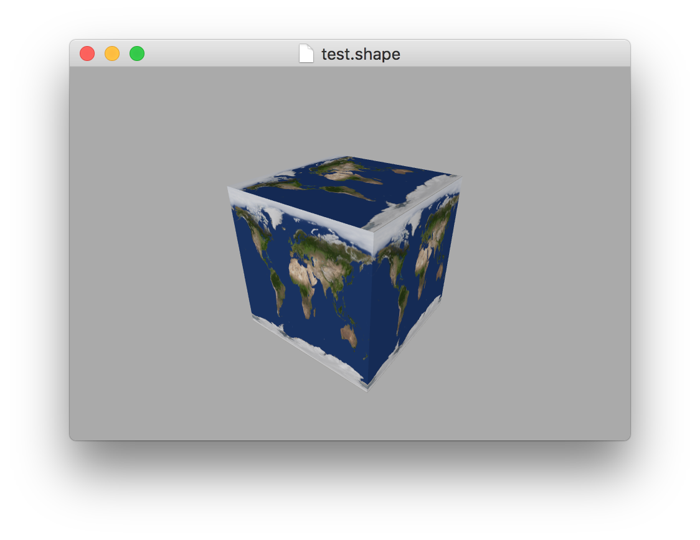
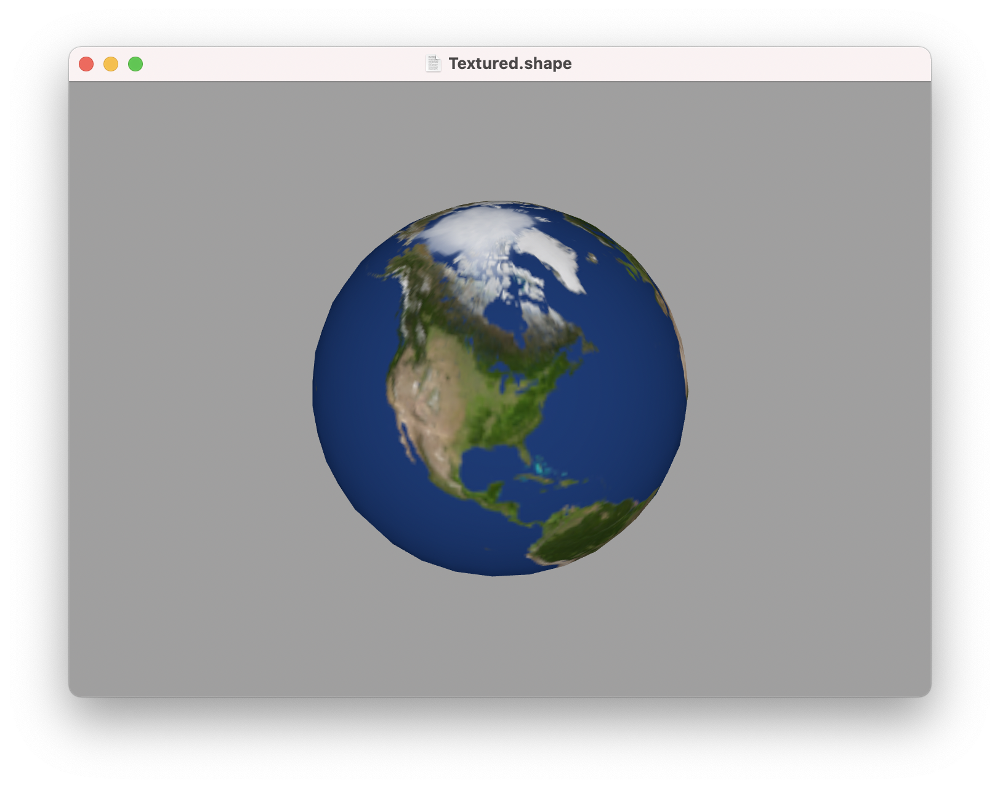
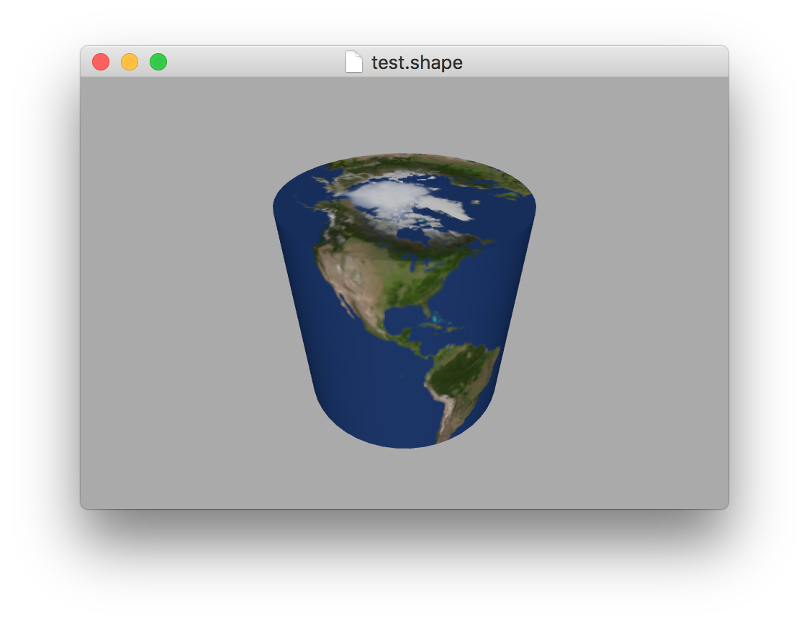
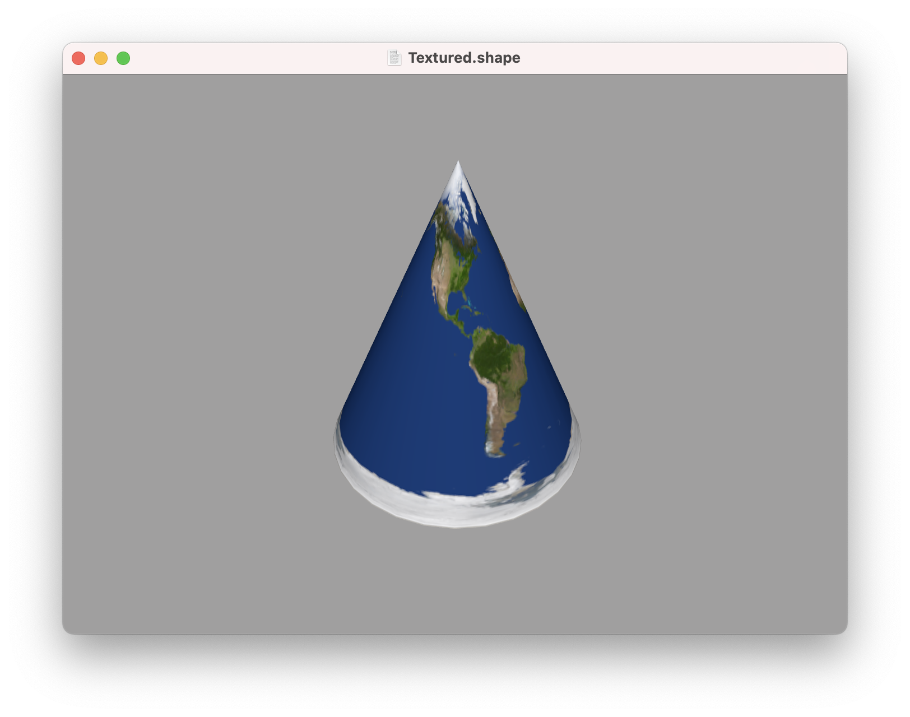

Materials
---

By default, all geometry that you create in ShapeScript appears as if it were made of a matte white plastic. You can alter this appearance using *materials*.

Material support in ShapeScript is fairly limited at the moment, but you can set the *color* and *texture* of shapes.

A given shape can only have either a color or texture, but not both. Setting the texture will clear the color and vice-versa.

## Color

You can alter the color of your shapes using the `color` command.

```swift
cube {
    color 1 0 0
}
```

As mentioned in [Getting Started](getting-started.md), `color` expects up to 4 values that represent the red, green, blue and alpha color channels respectively. Values should be specified in the range 0 (no color) to 1 (full color).

The red, green and blue channels control the color itself, and the alpha channel controls transparency. An alpha of 0 is fully transparent (invisible), and an alpha of 1 is fully opaque. If omitted, the alpha value defaults to 1.

If fewer than 3 parameters are passed to the `color` command, the first parameter is treated as a luminance (brightness) value, meaning that the resultant color will be set to a shade of gray between 0 (black) and 1 (white).

The table below shows how `color` values are interpreted, based on the number of components:

Number of parameters         | Meaning
:--------------------------- | :--------------------------
1                            | Luminance
2                            | Luminance and alpha
3                            | Red, green and blue
4                            | Red, green, blue and alpha

<br/>

ShapeScript defines some built-in color constants for you to use:

Name      | R   G   B   A
:---------| :------------
black     | 0   0   0   1
white     | 1   1   1   1
gray      | 0.5 0.5 0.5 1
red       | 1   0   0   1
green     | 0   1   0   1
blue      | 0   0   1   1
yellow    | 1   1   0   1
cyan      | 0   1   1   1
magenta   | 1   1   0   1
orange    | 1   0.5 0   1

<br/>

You can override these built-in colors using the `define` command, or define your own:

```swift
color red // use built-in red color

define red 1 0.3 0.1 // override the default red

define lightGray 0.8 // define a new color
```

Instead of numeric values, you can use web-style hex color codes to specify colors instead. These consist of a hash character (#) followed by 3 or 4 pairs of hexadecimal digits to specify color components in the range 0-255, and can be output by many popular graphics tools. Here are some examples:

```swift
color #FF0000 // pure red
color #7F7F7F // 50% gray
color #000000 // pure black
```

As with [web colors](https://en.wikipedia.org/wiki/Web_colors), you can use a shorthand 3-digit form as follows:

```swift
color #F00 // equivalent to #FF0000
```

And you can also use a fourth digit or pair of digits to specify alpha:

```swift
color #FF000066 // pure red with 40% opacity
color #F006 // equivalent to #FF000066
```

Because `color` is a command rather than an option, you can use it anywhere in your program and it will affect all subsequent shapes that you create. If you use the `color` command *inside* a shape or [group](groups.md) then its effect will end at the closing `}`:

```swift
color 0 1 0 // green
group {
    color 1 0 0 0.5 // translucent red
    cube // red cube
}
sphere // green sphere
```

## Texture

A texture is an image that is wrapped around a 3D shape, either as decoration, or to give the appearance of more surface detail than is actually there.

You can set the texture for your shapes using the `texture` command:

```swift
sphere {
    texture "filename.png"
}
```

The parameter for the `texture` command is the name of an external image file to display. The name can include either an absolute or relative file path. If a relative path is used it should be specified relative to the ShapeScript file that references it. The name must be enclosed in double quotes.

**Note:** The first time you try to use an image, you will see an error screen like the one below.



This is because macOS employs a security feature called *sandboxing* to prevent apps from accessing files without the user's permission. Use the `Grant Access` button to open the containing folder for your images. If you prefer, you can just grant access to the specific image file, but in that case you will need to grant access individually to each new texture that you use.

How a texture is wrapped around the model depends on the shape. Different shape types have different default wrapping schemes:









Currently there is no way to override the default wrapping scheme, but the way that you create a shape affects the way that it is textured.

For example, creating a cube using the `cube` command will result in a different texture wrapping effect than creating it by [extruding](builders.md#extrude) a square.

## Opacity

Opacity is a measure of how transparent an object is. You can vary the opacity for an object or group using the alpha property of the `color` (as described [above](#color)), but sometimes you may want to vary the opacity of a whole tree of differently-colored objects, and for that you can use the `opacity` command:

```swift
opacity 0.5
group {
    color 1 0 0 // opaque red
    cube // 50% transparent red cube
    color 0 1 0 // opaque green
    sphere // 50% transparent green sphere
}
```

Setting `opacity` affects all subsequently defined objects up until the end of the current [scope](scope.md). The `color` or `texture` of each object is multiplied by the current `opacity` value, so a `color` with alpha 0.5 combined with an `opacity` of 0.5 will result in the object being drawn with an overall opacity of 0.25.

Opacity is applied hierarchically. The value you specify with the `opacity` command is multiplied by the value set in the parent scope, so drawing an object with `opacity` 1.0 inside a scope with `opacity` 0.5 will result in in an opacity of 0.5, not 1.0, because the inner value is relative to the outer value.

As with the alpha property of `color`, `opacity` is measured in the range 0 (fully transparent) to 1 (fully opaque), however you can specify `opacity` values higher than 1. This can be useful for making an object *more* opaque than the base level for its current scope. For example, by setting `opacity` to 1 / [the parent scope opacity], you can cancel it out:

```swift
opacity 0.5
group {
    color 1 0 0 // opaque red
    cube // 50% transparent red cube
    color 0 1 0 // opaque green
    opacity 2 // cancel out the 50% opacity
    sphere // opaque green sphere
}
```

---
[Index](index.md) | Next: [Transforms](transforms.md)
