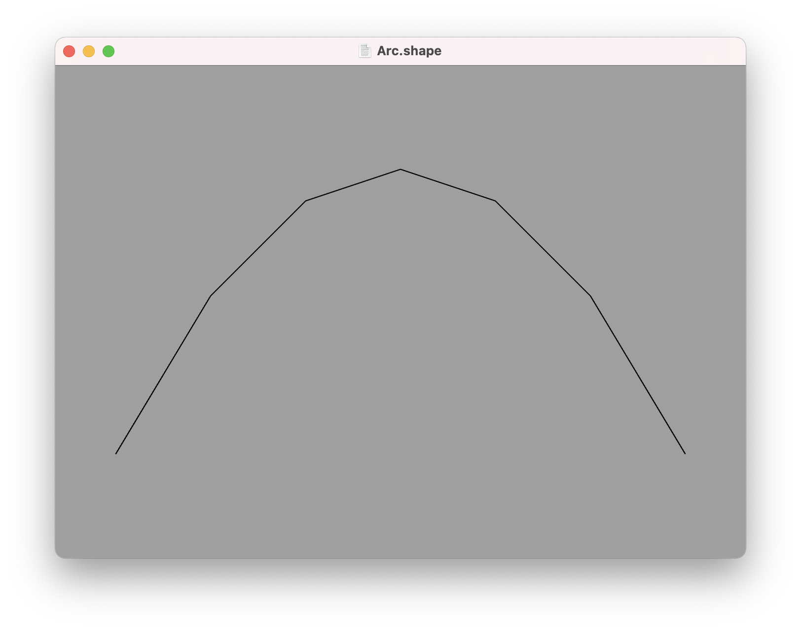
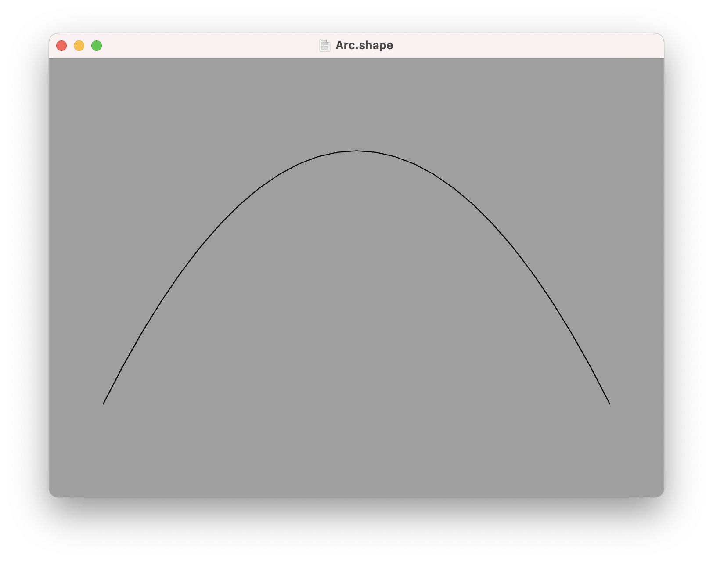
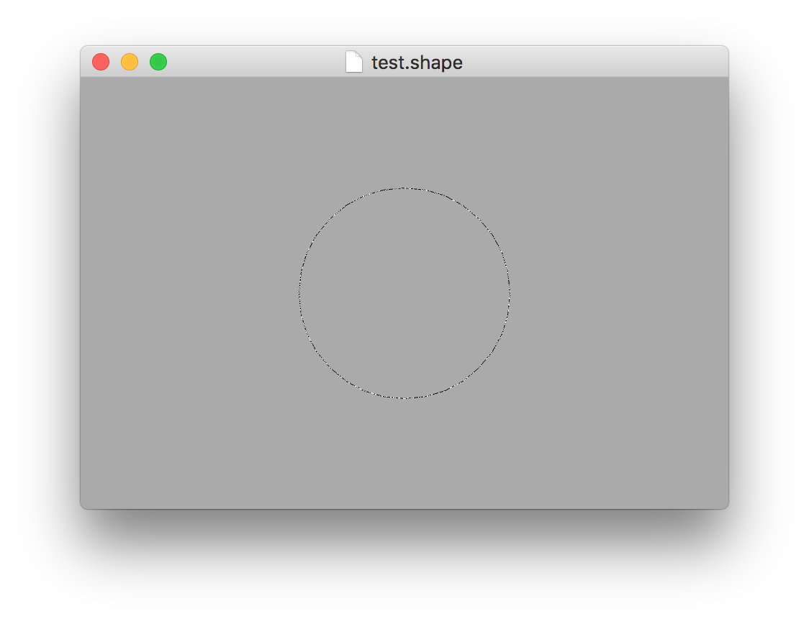
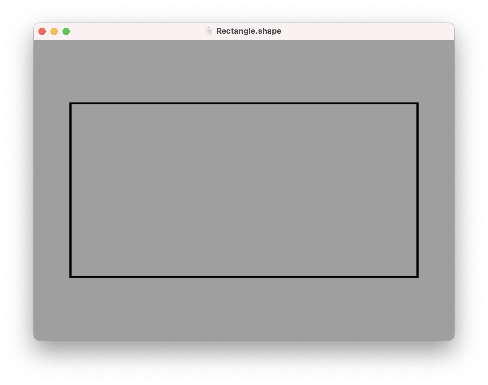
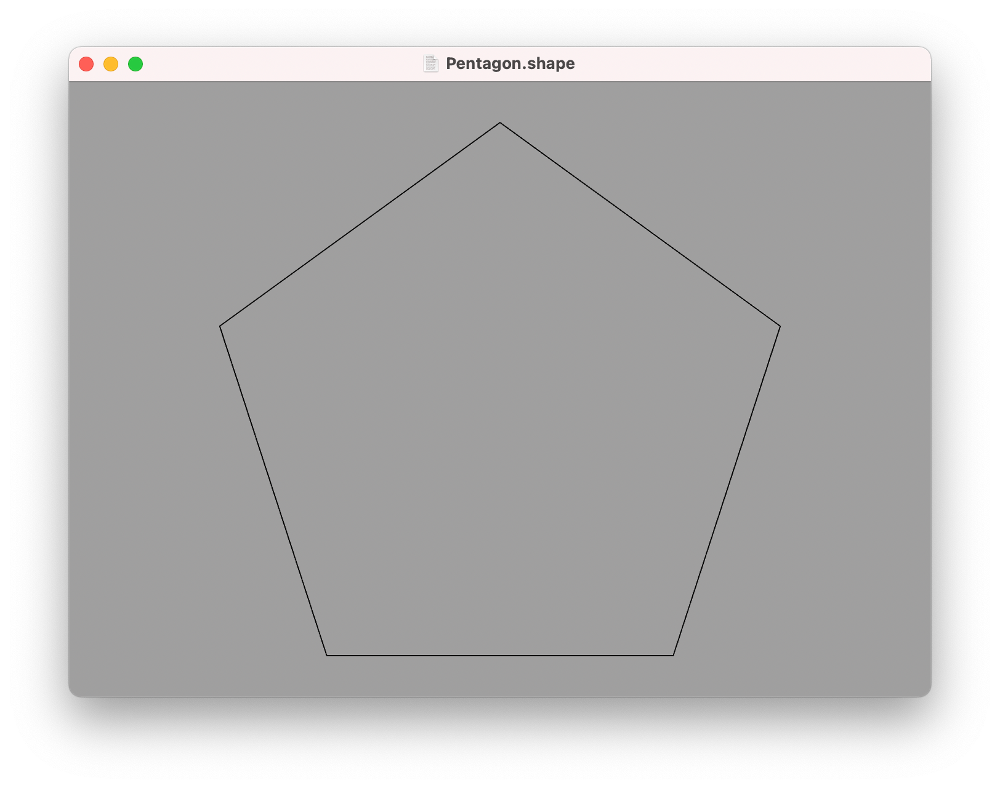
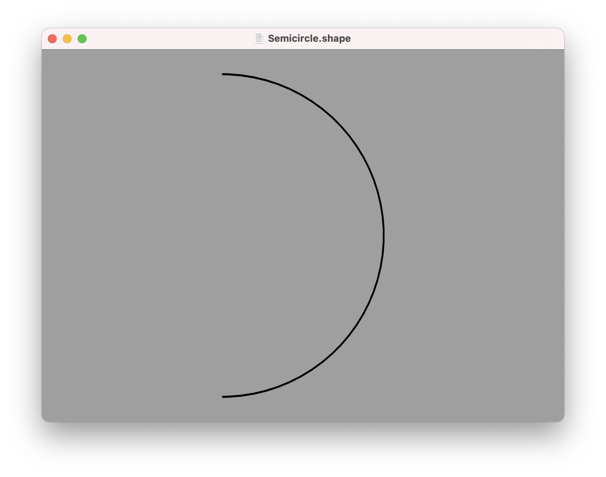
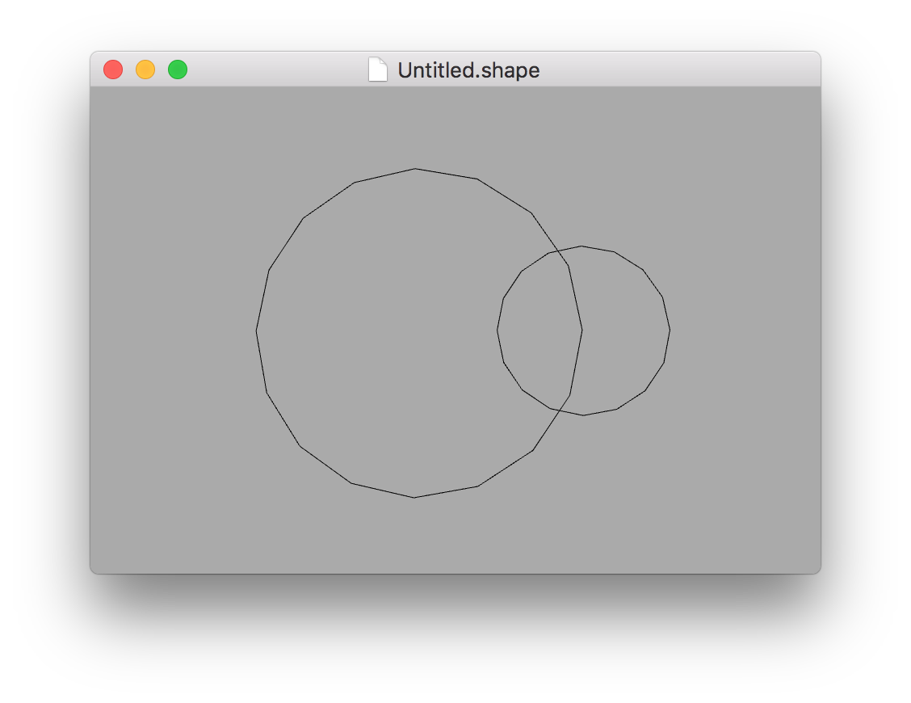

Paths
---

A path is sequence of line segments or curves joined end-to-end. The points of the path can be positioned anywhere in 3D space, and the path can be open-ended or closed.

Paths are not typically used directly as part of a 3D model (except possibly for something like a thin rope or antenna), but they can be used to define the contours of a 3D mesh (see [builders](builders.md) for details).

Paths cannot currently have any styling such as a color or texture applied to them - they will always appear as a thin black line in the ShapeScript app.

## Points

You define a path using a series of points. A path must have at least two points to be visible. The following path defines a short, horizontal line along the X axis.

```swift
path {
    point -1 0
    point 1 0
}
```


In the above example we used the `point` command, which accepts a [vector](literals.md#vectors-and-tuples) value. Paths can be 3-dimensional, so `point` can accept up to 3 coordinates, but most paths that you create in practice will be 2D (all points will have a Z value of 0).

Paths can be open or closed (meaning that the points form an unbroken loop). To create a closed path, the first and last point should have the same position.

The following path has 4 points, but it actually describes a triangle rather than a quadrilateral, because the first and last points are the same:

```swift
path {
    point 0 1
    point -1 -1
    point 1 -1
    point 0 1
}
```


## Curves

Points are great for defining polygonal shapes, but what about curves?

Curves can be created in ShapeScript are defined using [quadratic Béziers curves](https://en.wikipedia.org/wiki/Bézier_curve). A quadratic Bézier is defined by two end-points and a control point.

The curve passes through the end-points, but does not pass through the control point. Instead, the control point defines the point of intersection for the tangents of the curve as it passes through the end-points. This sounds complicated, but it's quite straightforward to use in practice.

To create a smooth curve, use the `point` command to define end points, and the `curve` command to define control points. For example, the following creates a smooth arc:

```swift
path {
    point -1 -1
    curve 0 1
    point 1 -1
}
```



You may notice that this "smooth" arc is not actually very smooth. As discussed in the [primitives section](primitives.md), 3D shapes are constructed from flat triangles, so likewise, curves are approximated using straight lines. You can adjust the smoothness of curves in a path using the `detail` command:

```swift
detail 99
path {
    point -1 -1
    curve 0 1
    point 1 -1
}
```



If multiple `curve` commands (control points) are used in sequence, an end-point will be interpolated at the mid-point between them. This allows you to easily create complex curves such as an "S" shape.

You can also create closed paths entirely using `curve` points. Eight `curve` points arranged in an octagon can closely approximate a circle (the 9th point is just a duplicate of the first, to close the path):

```swift
path {
    curve -0.414 1
    curve 0.414 1
    curve 1 0.414
    curve 1 -0.414
    curve 0.414 -1
    curve -0.414 -1
    curve -1 -0.414
    curve -1 0.414
    curve -0.414 1
}
```



## Circles

There is actually an easier way to create a circular path, which is to use the `circle` command:

```swift
circle
```

The result of calling `circle` is visually almost indistinguishable from the Bézier-based solution above (at a sufficiently high detail level), but you don't have to worry about calculating the positions of the control points.

Like the `sphere` primitive, the `circle` path has a default diameter of 1 unit, and its smoothness is controlled by the current `detail` setting, but these can both be overridden by passing explicit `size` and `detail` options:

```swift
circle {
    size 2
    detail 64
}
```

## Rectangles

To create a square or rectangle you can use the `square` command:

```swift
square
```

Like `circle`, `square` accepts a `size` option. The following will create a rectangle exactly twice as wide as it is tall:

```swift
square {
    size 2 1
}
```



You can even create a rectangle with rounded corners using the `roundrect` command:

```swift
roundrect
```

In addition to `size`, `roundrect` also accepts a `radius` option, which controls the corner radius:

```swift
roundrect {
    size 1
    radius 0.25
}
```


## Procedural Paths

The `circle` command is fine for creating complete circles, but what if you want a circular arc or semicircle? Calculating the Bézier control points for that manually would be tedious, so this is where the power of ShapeScript's procedural logic comes in handy.

To create a path procedurally, you can use a [for loop](loops.md) along with [relative transform commands](transforms.md#relative-transforms) such as `rotate`. For example, the following code generates a pentagon:

```swift
path {
    for 0 to 5 {
        point 0 1
        rotate 2 / 5
    }   
}
```



To generate a semicircle, we can use a similar approach:

```swift
path {
    for 0 to 8 {
        curve 0 1
        rotate 1 / 8
    }   
}
```



## Nested Paths

A path can be formed from multiple distinct sub-paths. To add additional sub-paths, you can nest a `path` command inside another one (or any other command that returns a path). The following code creates a path made up of two overlapping circles:

```swift
path {
    circle
    translate 0.5
    scale 0.5
    circle
}
```



---
[Index](index.md) | Next: [Text](text.md)
