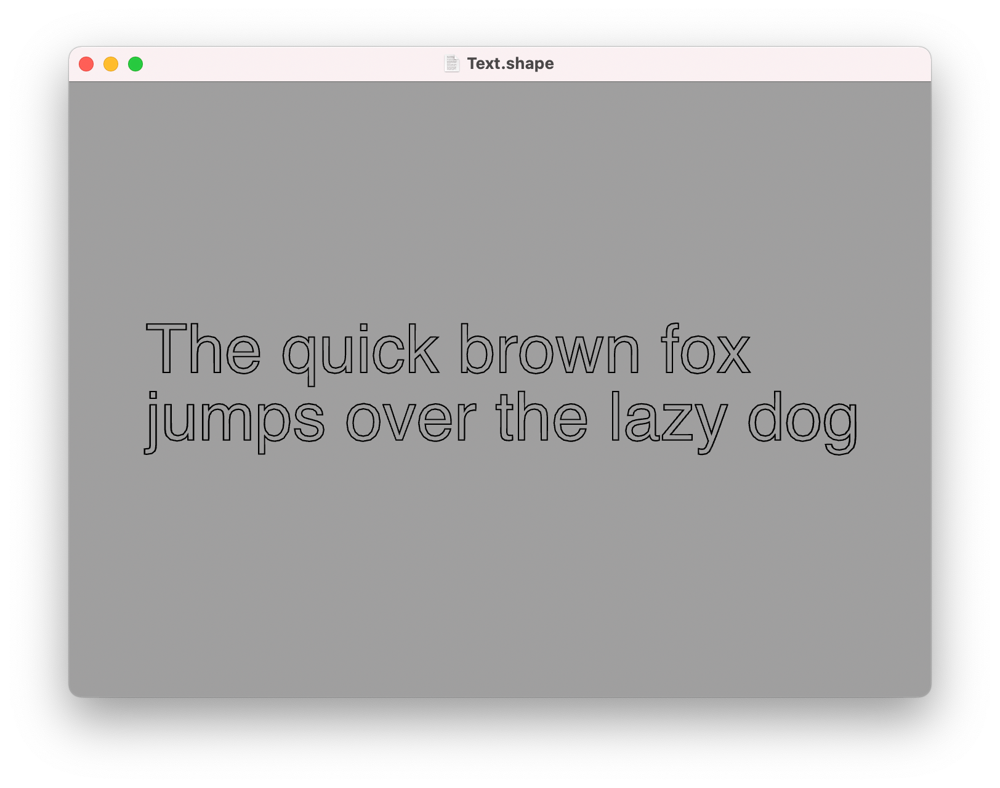
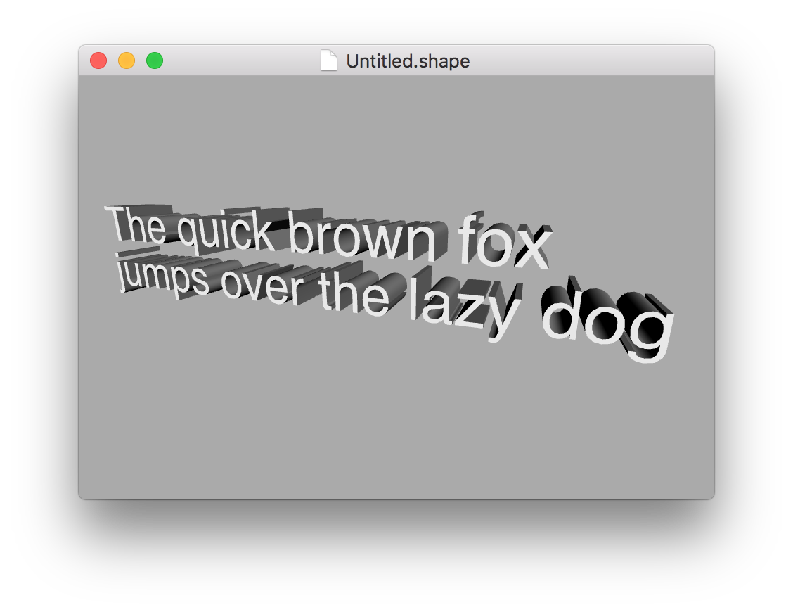

Text
---

The `text` command can be used to generate individual words, lines, or whole paragraphs of text. You use the `text` command as follows:

```swift
text "Hello World"
```

To create multiline text you can use the "\n" line-break sequence:

```swift
text "The quick brown fox\njumps over the lazy dog"
```

Or place each line of text on its own line within the file, surrounded by quotes:

```swift
text {
    "The quick brown fox"
    "jumps over the lazy dog"
}
```

The output of the `text` command is a series of [paths](paths.md), one for each character or *glyph* in the text:



You can use the `fill` or `extrude` commands to turn these paths into a solid mesh (see [builders](builders.md) for details):



## Size

To adjust the text size, you can use the [scale](transforms.md#relative-transforms) command prior to calling text:

```swift
scale 2 // increase text size by 200%
text "Hello World"
```

Alternatively, for filled or extruded text, you can set the size directly in the shape block using the [size](transforms.md#size) option:

```swift
extrude {
    size 2 0.5 // 200% sized text, with 50% depth
    text "Hello World"
}
```

## Position and Orientation

To adjust the text position and orientation, use the [translate and rotate](transforms.md#relative-transforms) commands:

```swift
translate 2 1 // move text 2 units to the right and 1 unit u
rotate 0.5 // rotate by 90 degrees
text "Hello World"
```

Or for filled or extruded text, you can set the [position](transforms.md#position) and [orientation](transforms.md#orientation) options inside the shape block:

```swift
extrude {
    position 1 2 3 // set the position in 3D space
    orientation 0.5 0 0 // set a 3D rotation
    text "Hello World"
}
```

## Font

To adjust the text font, you can use the `font` command. like `color` and other [material](materials.md) properties, `font` can be placed either inside the `text` block, or anywhere before it in the same scope:

```swift
font "Zapfino"
fill text "Hello World"
```


**Note:** Some fonts are inherently much more detailed than others, and may take a considerable time to generate. You may need to set the [detail](options.md#detail) option to a lower value for text than you would for other geometry.

---
[Index](index.md) | Next: [Builders](builders.md)
