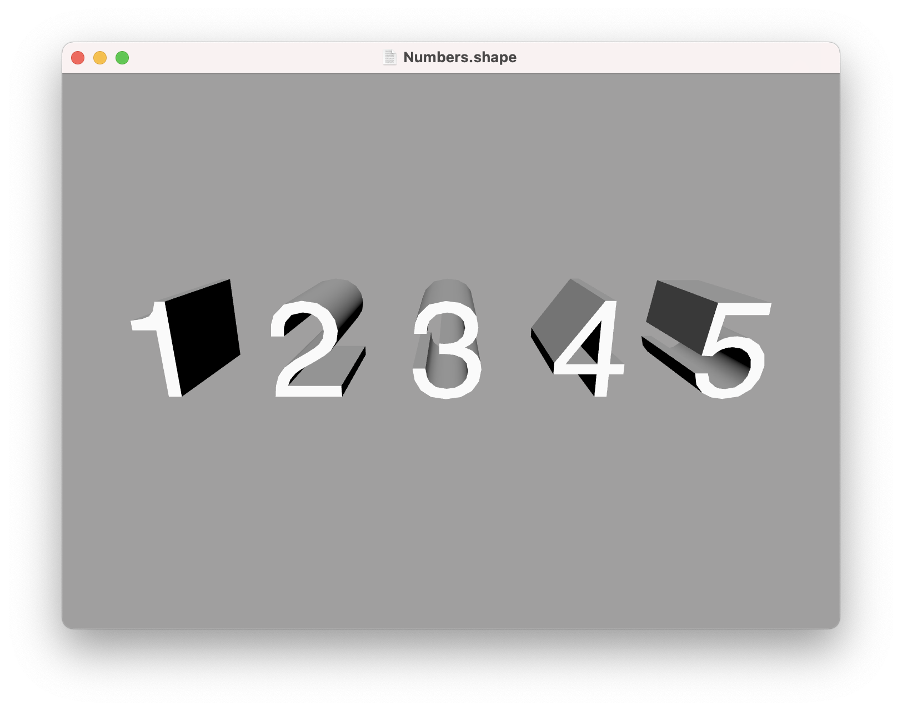

Text
---

The `text` command can be used to generate individual words, lines, or whole paragraphs of text. You use the `text` command as follows:

```swift
text "Hello World"
```

To create multiline text you can use the "\n" line-break sequence:

```swift
text "The quick brown fox\njumps over the lazy dog"
```

Or place each line of text on its own line within the file, surrounded by quotes:

```swift
text {
    "The quick brown fox"
    "jumps over the lazy dog"
}
```

The output of the `text` command is a series of [paths](paths.md), one for each character or *glyph* in the text:


You can use the `fill` or `extrude` commands to turn these paths into a solid mesh (see [builders](builders.md) for details):


For your convenience, the text command will automatically convert numeric values to their character representation. The following displays the numbers 1 to 5 as 3D text:

```swift
for i in 1 to 5 {
    extrude text i
    translate 1
}
```



## Size

To adjust the text size, you can use the [size](transforms.md#size) option:

```swift
text {
    size 2 // increase text size by 200%
    text "Hello World"
}
```

You can resize the text non-uniformly by passing separate width and height values for the size:

```swift
text {
    size 2 1.5 // set width to 200% and height to 150%
    text "Hello World"
}
```

Alternatively, for extruded text, you can set the size in the shape block instead, which allows you to also set the depth at the same time:

```swift
extrude {
    size 2 2 0.5 // 200% sized text, with 50% depth
    text "Hello World"
}
```

## Position and Orientation

To adjust the text position and orientation, use the [position](transforms.md#position) and [orientation](transforms.md#orientation) commands:

```swift
text {
    position 2 1 // move text 2 units to the right and 1 unit up
    orientation 0.5 // rotate by 90 degrees
    "Hello World"
}
```

Or for filled or extruded text, you can set these on the containing shape block instead:

```swift
fill {
    position 1 2 3 // set the position in 3D space
    orientation 0 0.5 0 // rotate around the Y axis
    text "Hello World"
}
```

## Font

To adjust the text font, you can use the `font` command. like `color` and other [material](materials.md) properties, `font` can be placed either inside the `text` block, or anywhere before it in the same scope:

```swift
font "Zapfino"
fill text "Hello World"
```


**Note:** Some fonts are inherently much more detailed than others, and may take a considerable time to generate. You may need to set the [detail](options.md#detail) option to a lower value for text than you would for other geometry.

---
[Index](index.md) | Next: [Builders](builders.md)
