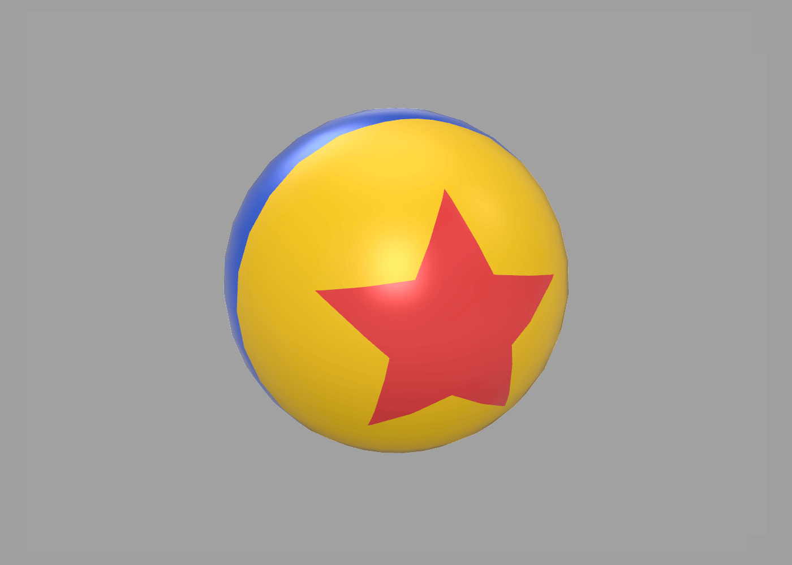
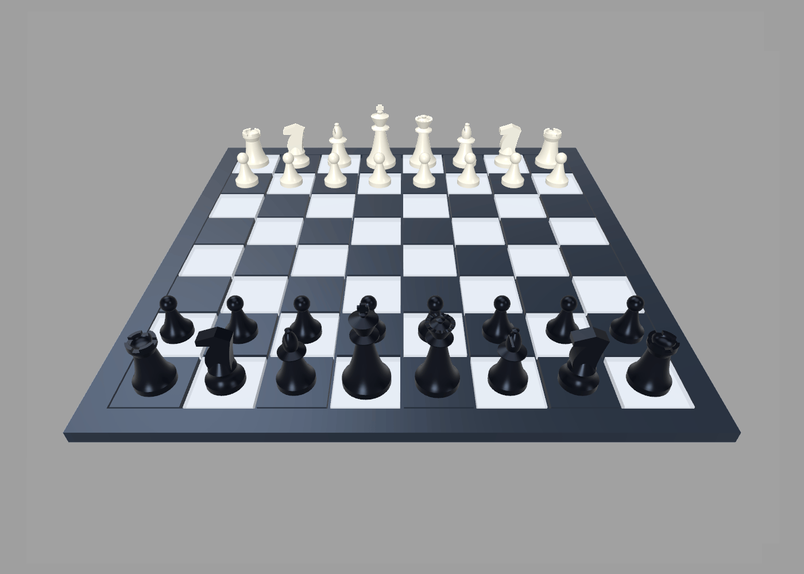
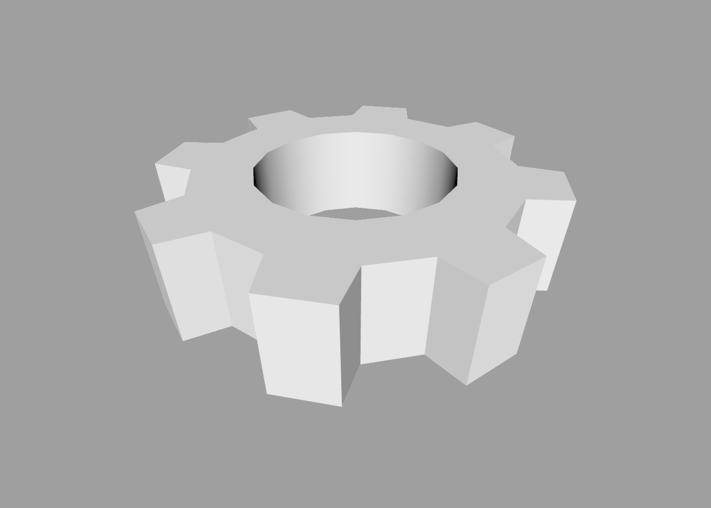
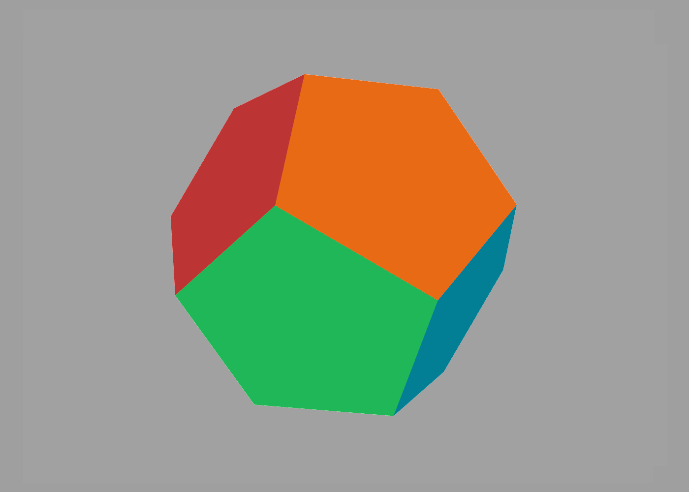
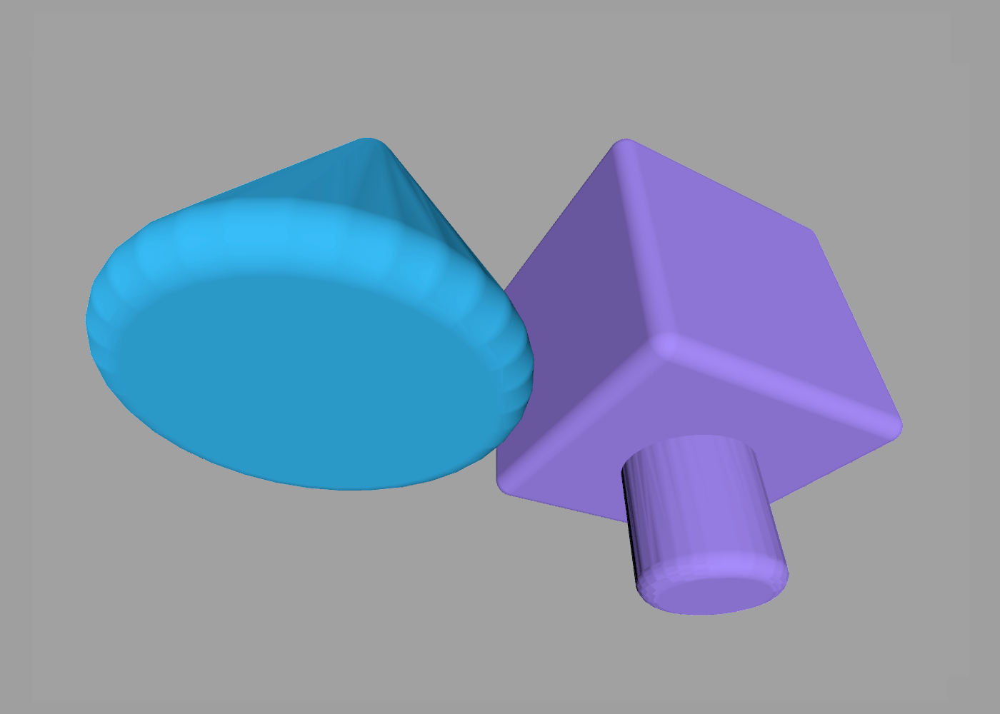
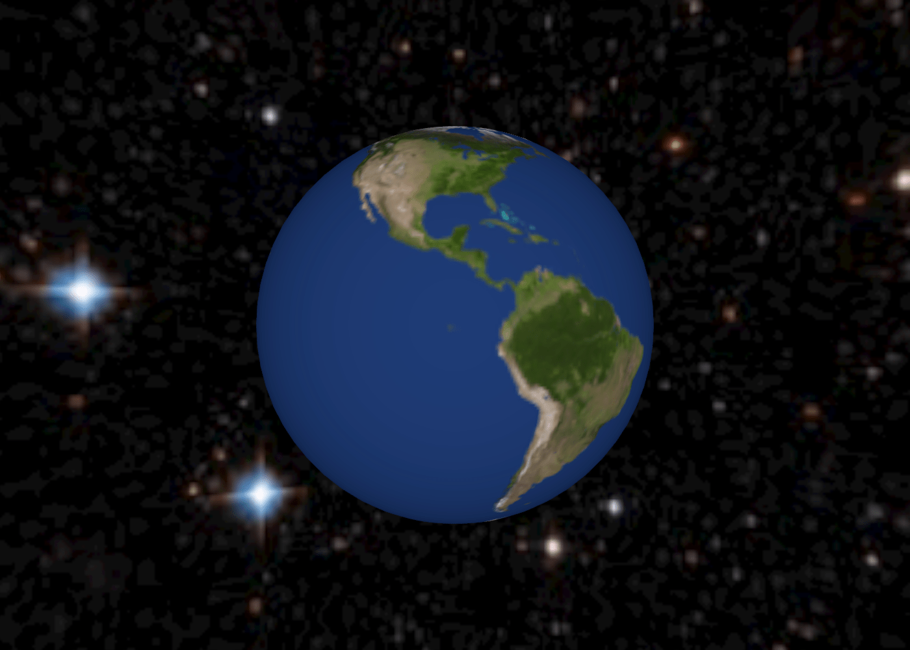
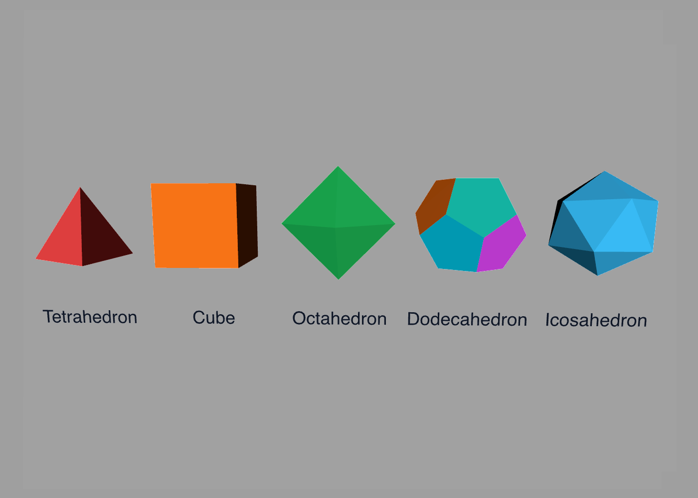
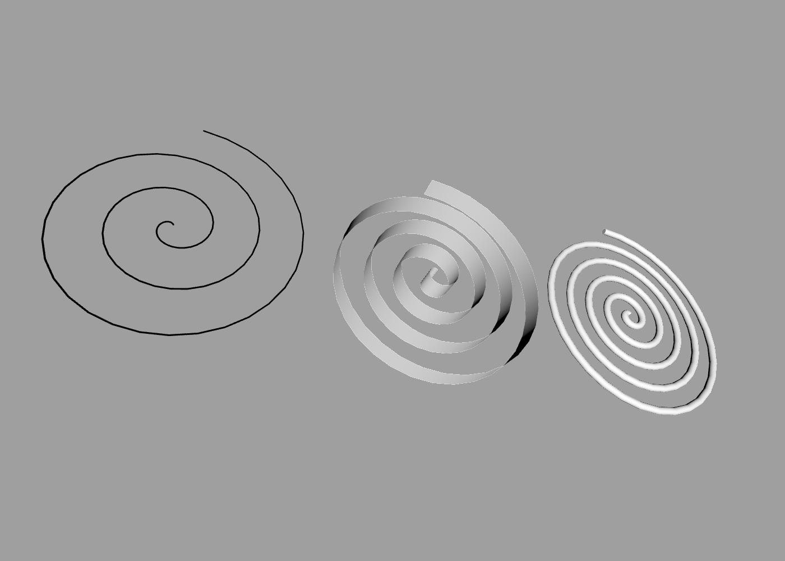
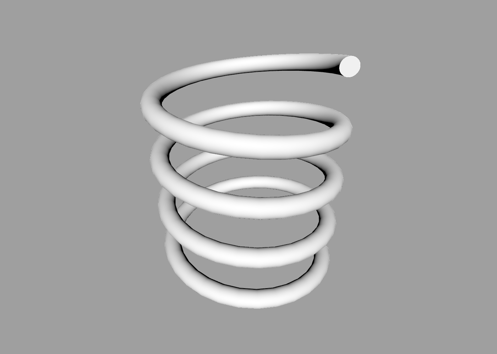
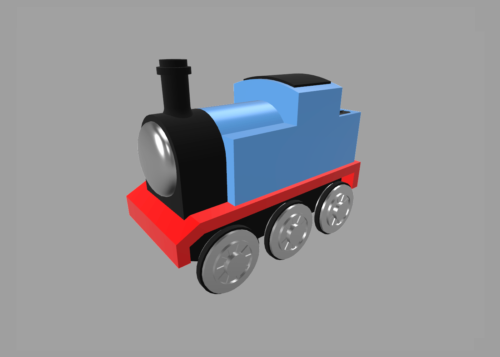

Examples
---

ShapeScript includes a number of example files that demonstrate various features. You can find these under the `Help > Examples` menu.

## Ball

The Ball example demonstrates how to use the [stencil](csg.md#stencil) command to "paint" patterns on a sphere, as well as a [for loop](control-flow.md#loops) to generate a star shape that is then [extruded](builders.md#extrude).

## Chessboard

The Chessboard example demonstrates the use of [for loops](control-flow.md#loops) to duplicate shapes, along with [paths](paths.md), [lathe builders](builders.md#lathe) and [CSG](csg.md) operations.

## Cog

The Cog example demonstrates procedural generation of a complex [path](paths.md) using a [for loop](control-flow.md#loops), as well as the creation of a custom [block](blocks.md) and the use of the [option](blocks.md#options) command to pass parameters.

## Dodecahedron

The Dodecahedron example demonstrates how to build a complex [mesh](meshes.md) from structured data and in-script calculations. It starts with a low-detail [icosphere](primitives.md#icosphere), calculates the dodecahedron vertex positions from its polygon centers, then uses face-index and color data to build the final pentagonal polygons.

## Fillet

The Fillet example demonstrates how to define a reusable geometry function that combines the [inset](functions.md#geometry) function with [Minkowski addition](builders.md#minkowski) to produce rounded mesh edges while preserving the original overall dimensions.

## Earth

The Earth example demonstrates use of the [texture](materials.md#texture) command to turn a simple sphere into a model of the globe, along with the [background](commands.md#background) command to add a star field behind it.

## Platonic Solids

The Platonic Solids example demonstrates how low-detail [cone](primitives.md#cone), [cube](primitives.md#cube), [sphere](primitives.md#sphere) and [icosphere](primitives.md#icosphere) primitives can be used to create several regular solids without manually defining mesh polygons. It also demonstrates using the [import](commands.md#import) command to reuse the Dodecahedron example as one of the solids.

## Spirals

The Spirals example demonstrates using the [extrude](builders.md#extrude) command to create a spiral. This example also demonstrates the use of [for loops](control-flow.md#loops) and user-defined [options](blocks.md#options).

## Spring

The Spring example demonstrates how to use the [loft](builders.md#loft) command and a [for loop](control-flow.md#loops) to create a coiled spring shape.

## Train

The Train demonstrates a combination of modeling techniques, including using the [rnd](commands.md#random-numbers) command to generate pseudo-random coal.

---
[Index](index.md) | Next: [Glossary](glossary.md)
