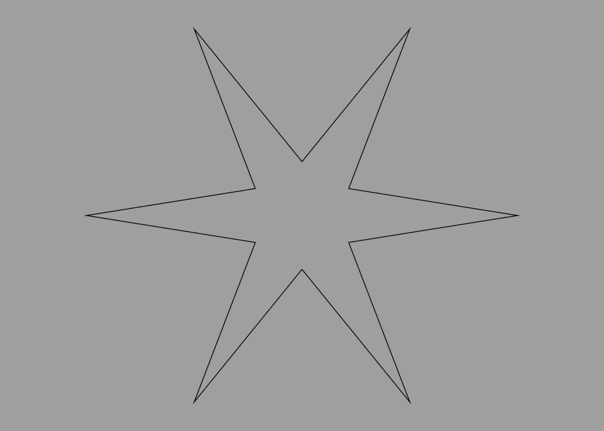

Blocks
---

A block is a nested list of instructions, contained inside `{ ... }` braces. Some commands, such as [builders](builders.md) or [CSG operations](csg.md), accept a block parameter instead of a simple value like a number or [vector](literals.md).

Instructions inside a block are executed within the [scope](scope.md) of the command that invoked them. Typically that means that any transforms or material changes made inside the block will only apply to geometry created inside the same block. This also applies to any symbols that you define inside the block.

You can define your own blocks using the `define` command. Here is a block that creates a five-pointed star:

```swift
define star {
    path {
        for 1 to 5 {
            point 0 -0.5
            rotate 1 / 5
            point 0 -1
            rotate 1 / 5
        }
        point 0 -0.5
    }
}
```

You can call it by simply referencing its name, like this:

```swift
star
```


**Note:** there is a subtle distinction between the code above and the code below:

```swift
define star path {
    for 1 to 5 {
        point 0 -0.5
        rotate 1 / 5
        point 0 -1
        rotate 1 / 5
    }
    point 0 -0.5
}
```

In the original code, we defined a new block symbol that creates a star-shaped path. In the code above we've defined a symbol whose value is a star-shaped path. The former code is evaluated at the point when it is *called*, whereas the latter code is evaluated at the point when it is *defined*.

The end-result is the same in this case, so it may seem like the distinction doesn't matter, but the advantage of the former approach is that we can add *options* to vary the behavior of the code when it is called.

## Options

To add an option to a block, you use the `option` command. This works in a similar way to the [define](symbols.md) command, but it allows the specified value to be overridden by the caller.

The code below extends the `star` definition with options for the radius and number of points:

```swift
define star {
    option radius 1
    option points 5
    path {
        for 1 to points {
            point 0 -0.5
            rotate 1 / points
            point 0 -radius
            rotate 1 / points
        }
        point 0 -0.5
    }
}
```

Now we can use those options to create a star with 6 points if we choose:

```swift
star {
    points 6
    radius 2
}
```



---
[Index](index.md) | Next: [Scope](scope.md)
