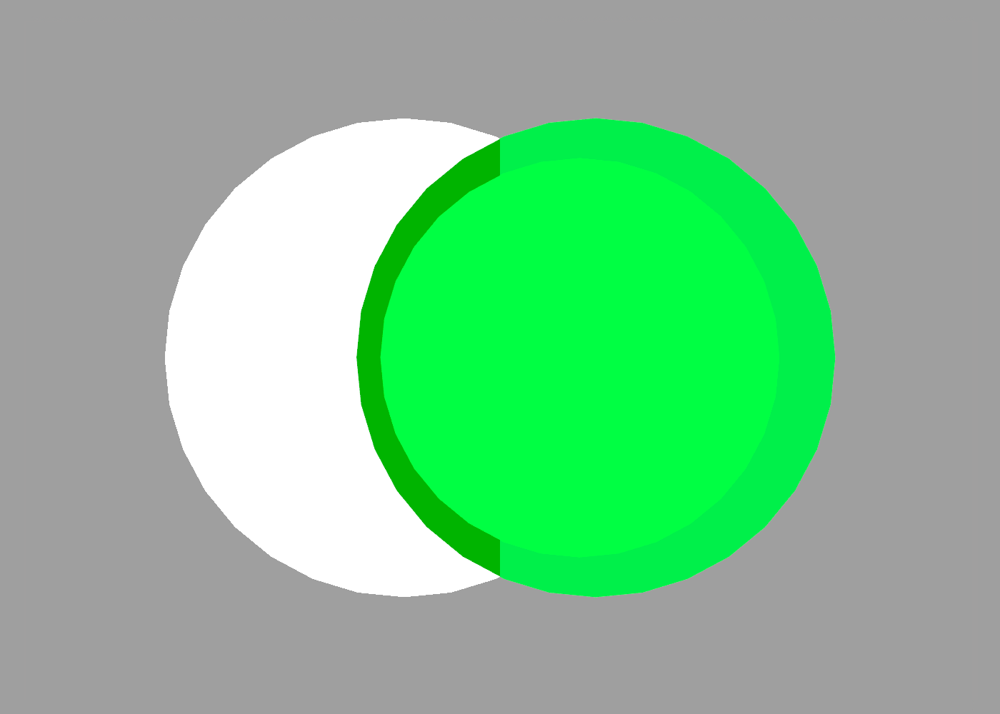

Debugging
---

When using the [constructive solid geometry](csg.md) operations it can sometimes be difficult to visualize the individual components that comprise a given shape. In the example below, a moon shape is created by subtracting one cylinder from another:

```swift
difference {
    cylinder {
        size 1 0.2
    }
    
    // cylinder not visible in viewer
    cylinder {
        position 0.4
        size 1 0.2
    }
}
```


Because the second cylinder is subtracted from the first, we can't actually see it, which means we can't [select it](getting-started.md#debugging-and-selection) to get information about it, or properly understand its shape. To solve this, we can use the `debug` command:

```swift
difference {
    cylinder {
        size 1 0.2
    }
    
    // debug command makes cylinder visible
    debug cylinder {
        position 0.4
        size 1 0.2
    }
}
```

This makes the cylinder visible in the ShapeScript viewer and allows it to be selected like any other shape.



## Logging

When creating complex scripts, it can sometimes be difficult to understand what's happening in the code. To help you debug your scripts, you can use the `print` command:

```swift
print 5 + 6

print "some text"

print someValue
```

The `print` command accepts one or more arguments of any type. You can use this to intersperse values and text labels for example:

```swift
print "width =" width

print "x:" x "y:" y
```

Printed values are displayed in a console area below the scene. The console can be resized and scrolled to show as much text as you need.

## Assertions

Rather than merely printing a value, sometimes you want to be certain that it has a particular value (or range of values). You can do that with the `assert` command:

```swift
assert color = red // no other color will do
```

The assert function accepts a single boolean value or expression, and will raise an error if it evaluates to false.

So when would this be useful? Suppose that you have defined a block, like the [star example](blocks.md#options) and you want a way to specify that it must have at least 4 points and a nonzero radius. You could do that like this:

```swift
define star {
    option radius 1
    assert radius > 0
    option points 5
    assert points >= 4
    path {
        for 1 to points {
            point 0 -0.5
            rotate 1 / points
            point 0 -radius
            rotate 1 / points
        }
        point 0 -0.5
    }
}
```

Now, if you (or someone else) tries invoke `star` with invalid options, it will raise a meaningful error instead of just producing broken-looking geometry.

---
[Index](index.md) | Next: [Import](import.md)
