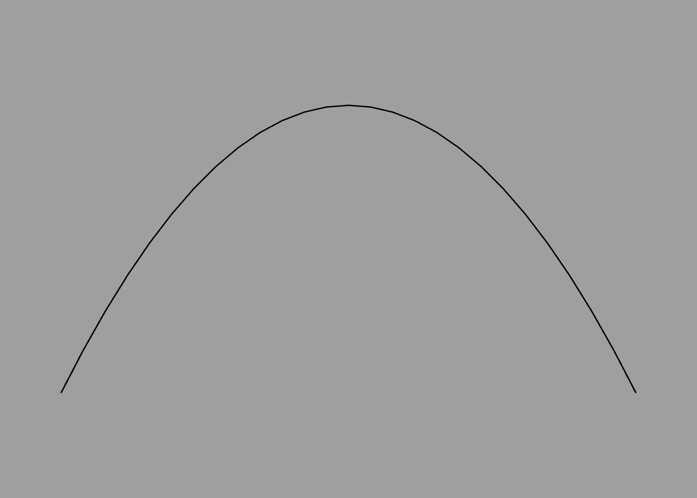
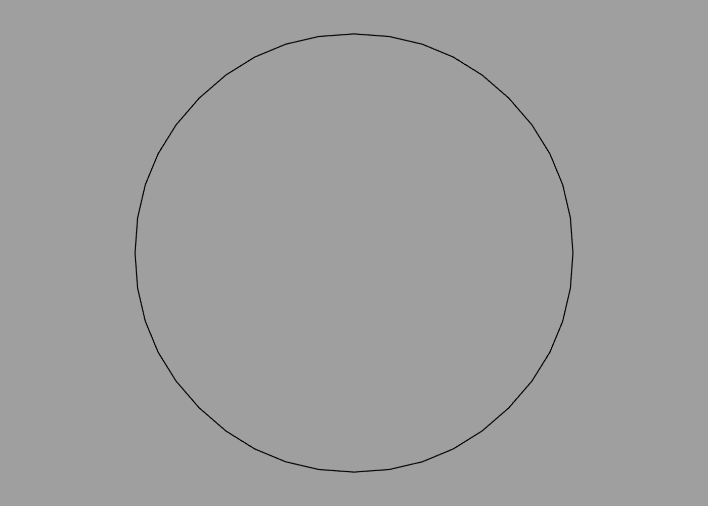
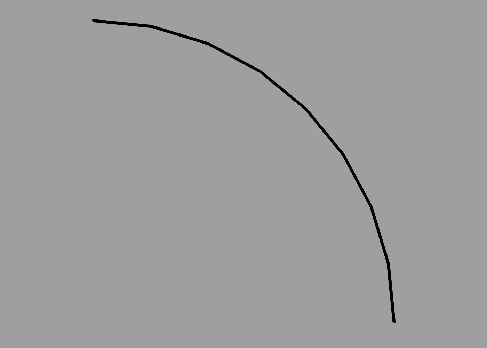
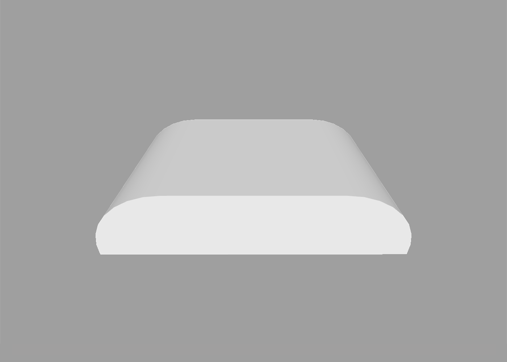
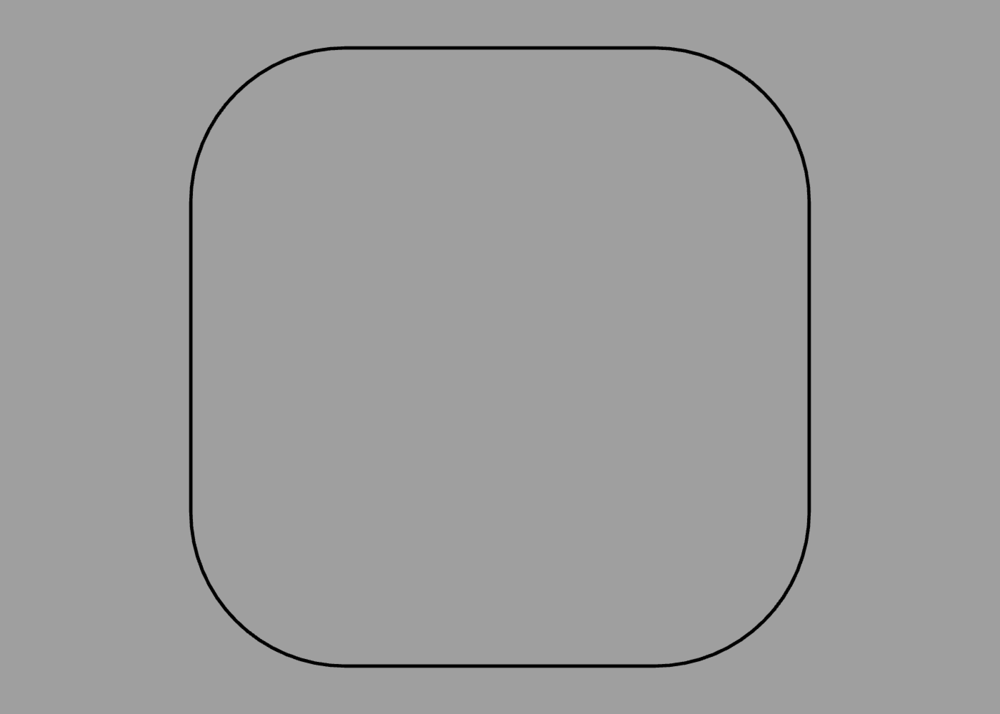
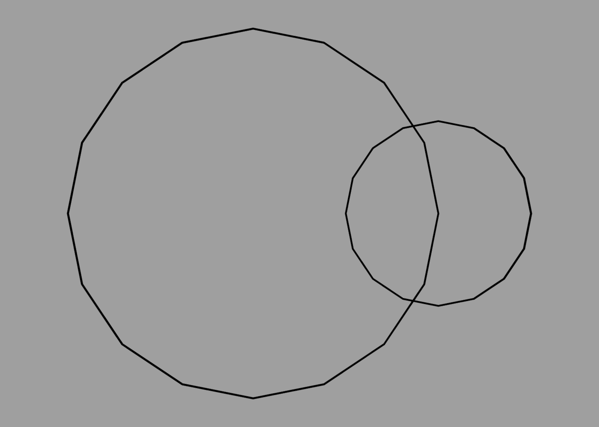
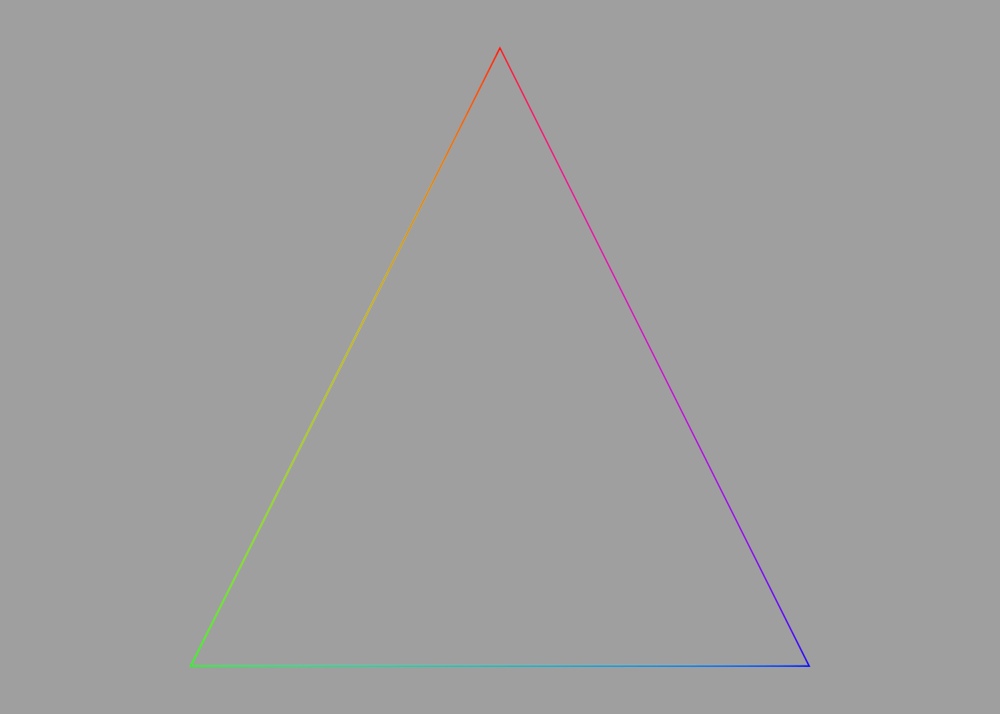

Paths
---

A path is a sequence of line segments or curves joined end-to-end. The points of the path can be positioned anywhere in 3D space, and the path can be open-ended or closed.

Paths are not typically used directly as part of a scene (except possibly for something like a thin rope or antenna), but they can be used to define the contours or profile of a 3D shape (see [builders](builders.md) for details).

## Points

As with the [polygons](meshes.md#polygons-and-points) in a mesh, you define a path using a series of points. A path must have at least two points to be visible. The following path defines a short, horizontal line along the X axis.

```swift
path {
    point -1 0
    point 1 0
}
```


In the above example we used the `point` command, which accepts a [vector](literals.md#vectors-and-tuples) value. Paths can be three-dimensional, so `point` accepts up to three coordinates, but most paths that you create in practice will be 2D (all points will have a Z value of zero).

Paths can be open or closed (meaning that the points form an unbroken loop). To create a closed path, the first and last point must have the same position. The following path has four points, but it actually describes a triangle rather than a quadrilateral, because the first and last points are the same:

```swift
path {
    point 0 1
    point -1 -1
    point 1 -1
    point 0 1
}
```


## Curves

Points are great for defining polygonal shapes, but what about curves?

Curves in ShapeScript are typically created using [quadratic Béziers](https://en.wikipedia.org/wiki/Bézier_curve). A quadratic Bézier is defined by two end-points and a control point.

The curve passes through the end-points, but does not pass through the control point. Instead, the control point defines the point of intersection for the tangents of the curve as it passes through the end-points. This sounds complicated, but it's quite straightforward to use in practice.

To create a smooth curve, use the `point` command to define end points, and the `curve` command to define control points. For example, the following creates a smooth arc:

```swift
path {
    point -1 -1
    curve 0 1
    point 1 -1
}
```


You may notice that this "smooth" arc is not actually very smooth. Just as [3D meshes](meshes.md) are constructed from flat polygons, curves are approximated using straight lines. You can adjust the smoothness of curves in a path using the `detail` command:

```swift
path {
    detail 99
    point -1 -1
    curve 0 1
    point 1 -1
}
```



If multiple `curve` commands (control points) are used in sequence, an end-point will be interpolated at the mid-point between them. This allows you to easily create complex curves such as an "S" shape.

You can also create closed paths entirely using `curve` points. Eight `curve` points arranged in an octagon can closely approximate a circle (the ninth point is just a duplicate of the first, to close the path):

```swift
path {
    curve -0.414 1
    curve 0.414 1
    curve 1 0.414
    curve 1 -0.414
    curve 0.414 -1
    curve -0.414 -1
    curve -1 -0.414
    curve -1 0.414
    curve -0.414 1
}
```



## Arcs

Arcs created by Bézier curves can approximate a circle, but not perfectly. If you need a precisely circular curve, you can use the `arc` command:

```swift
arc {
    angle 0.5   
}
```

The `angle` option defines the angular span of the arc, starting clockwise from the Y axis. The angle is measured in *half-turns* (as explained in the [Transforms](transforms.md#orientation) section) so the `0.5` in the example above produces a quarter circle:



To adjust the starting angle, you can use the [orientation option](transforms.md#orientation) or [rotate command](transforms.md#relative-transforms) as you would for any other shape. The following creates an arc from -45 degrees to +90 degrees:

```swift
arc {
    orientation -0.25
    angle 0.75
}
```

Arcs have a default radius of 0.5 units. You can increase or decrease this using the `size` option:

```swift
arc {
    size 2 // radius of 1 unit (0.5 * 2)
}
```

Arcs can be used in conjunction with individual path points or other arcs to make more complex shapes. The following creates a slab with curved corners:

```swift
extrude path {
    // left arc
    arc {
        angle -0.5
    }
    // bottom-left corner
    point -0.5 0
    // bottom-right corner
    point 1.5 0
    // right arc
    arc {
        position 1 0
        orientation 0.5
        angle -0.5
    }
    // close path with smooth join
    curve 0 0.5
}
```



## Circles

If you need a complete circle, there's an even simpler way than using `arc`, which is to use the `circle` command:

```swift
circle
```

Like the `sphere` primitive, the `circle` path has a default diameter of 1 unit, and its smoothness is controlled by the current `detail` setting, but these can both be overridden by passing explicit `size` and `detail` options:

```swift
circle {
    size 2
    detail 64
}
```

## Rectangles

To create a square or rectangle you can use the `square` command:

```swift
square
```

Like `circle`, `square` accepts a `size` option. The following will create a rectangle exactly twice as wide as it is tall:

```swift
square {
    size 2 1
}
```


You can even create a rectangle with rounded corners using the `roundrect` command:

```swift
roundrect
```

In addition to `size`, `roundrect` also accepts a `radius` option, which controls the corner radius:

```swift
roundrect {
    size 1
    radius 0.25
}
```



## Regular Polygons

When used outside of a `mesh`, the `polygon` command can be used to create a regular polygon. The following creates a pentagon:

```swift
polygon {
    sides 5
}
```


The output for this is similar to using the `circle` command with a specific detail value:

```swift
circle {
    detail 5
}
```

The difference is only apparent if you extrude the result, because in the circle's case the extruded sides are [smoothed](options.md#smoothing) by default, whereas for the polygon they are sharply defined:

```swift
extrude polygon {
    position -1
    sides 6
}

extrude circle {
    position 1
    detail 6
}
```


## Procedural Paths

The `circle` command is fine for creating complete circles, but what if you want a circular arc or semicircle? Calculating the Bézier control points for that manually would be tedious, so this is where the power of ShapeScript's procedural logic comes in handy.

To create a path procedurally, you can use a [for loop](control-flow.md#loops) along with [relative transform commands](transforms.md#relative-transforms) such as `rotate`. For example, the following code generates a semicircle:

```swift
path {
    for 0 to 8 {
        curve 0 1
        rotate 1 / 8
    }   
}
```


## Nested Paths

A path can be formed from multiple distinct sub-paths. To add additional sub-paths, you can nest a `path` command inside another one (or any other command that returns a path). The following code creates a path made up of two overlapping circles:

```swift
path {
    circle
    translate 0.5
    scale 0.5
    circle
}
```



## Path Colors

Paths cannot currently be textured, but they inherit the current [material color](materials.md#color). Color can also be applied to individual points within a path. When neighboring path points have different colors applied, the color will be smoothly interpolated between them, creating a gradient:

```swift
path {
    color red
    point 0 1
    color green
    point -1 -1
    color blue
    point 1 -1
}
```



## SVG Paths

[Scalable Vector Graphics (SVG)](https://en.wikipedia.org/wiki/Scalable_Vector_Graphics) is a popular standard for defining vector graphics. SVG is a fairly complex XML-based format, but a subset of the SVG standard defines a simple text-based [path syntax](https://www.w3.org/TR/SVG11/paths.html#PathData) that uses a series of single-character instructions, each followed by one or more coordinates to define a path. For example, the following SVG path code defines a triangle:

```svg
<path d="M 100 100 L 300 100 L 200 300 z"/>
```

You can use this syntax in ShapeScript by taking just the `d` attribute from the path and passing it to the `svgpath` command, as follows:

```swift
fill svgpath "M 100 100 L 300 100 L 200 300 z"
```

You can fill or extrude an `svgpath` and adjust its size, position, etc. as follows:

```swift
fill svgpath {
    size 0.01
    position -2 2
    "M 100 100 L 300 100 L 200 300 z"
}
```

Which produces the following output:


**Note:** SVG uses a flipped vertical coordinate system relative to that used by ShapeScript. To compensate for this, vertical (Y) coordinates passed to the `svgpath` command are treated as negative.

---
[Index](index.md) | Next: [Text](text.md)
