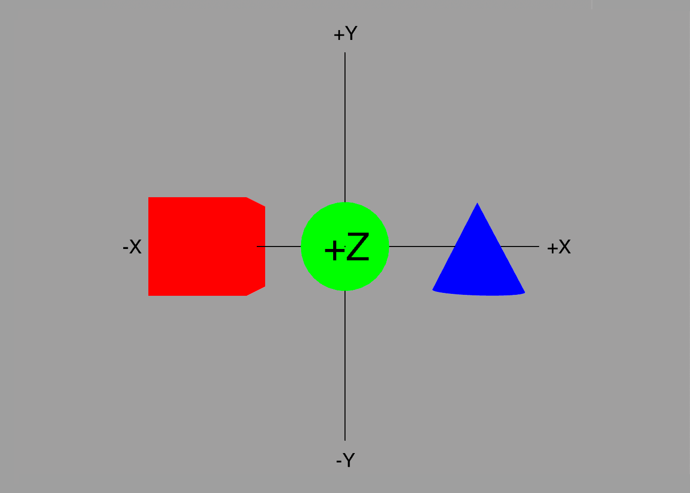
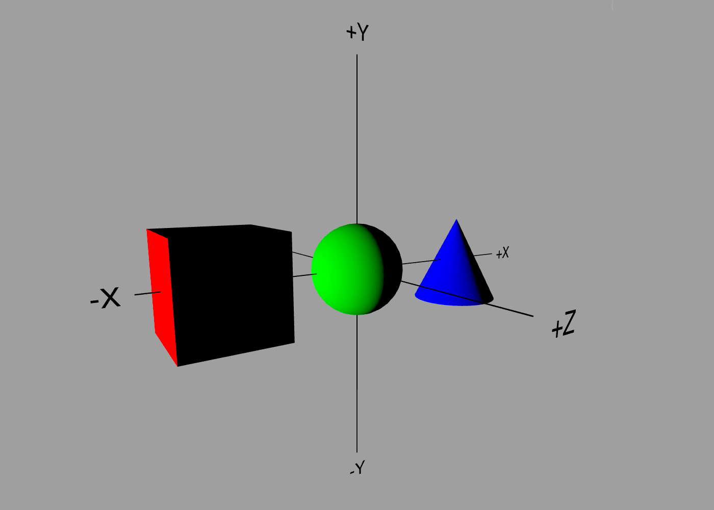
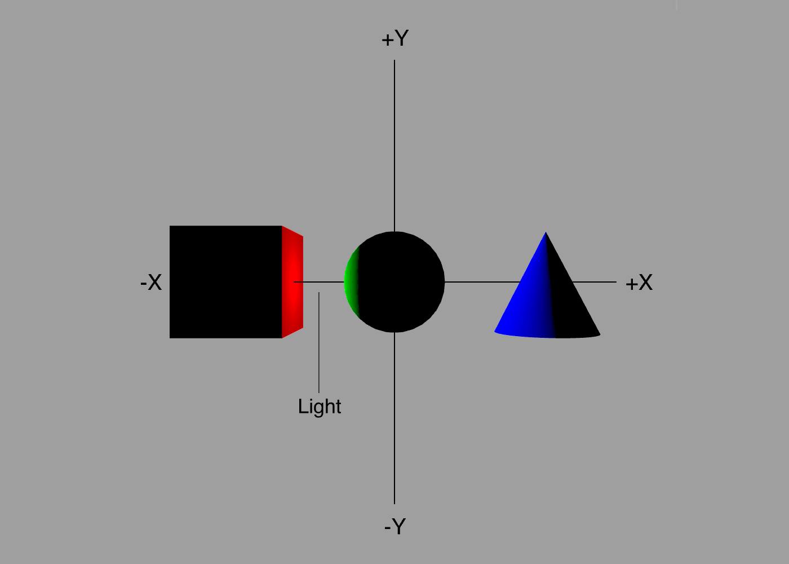
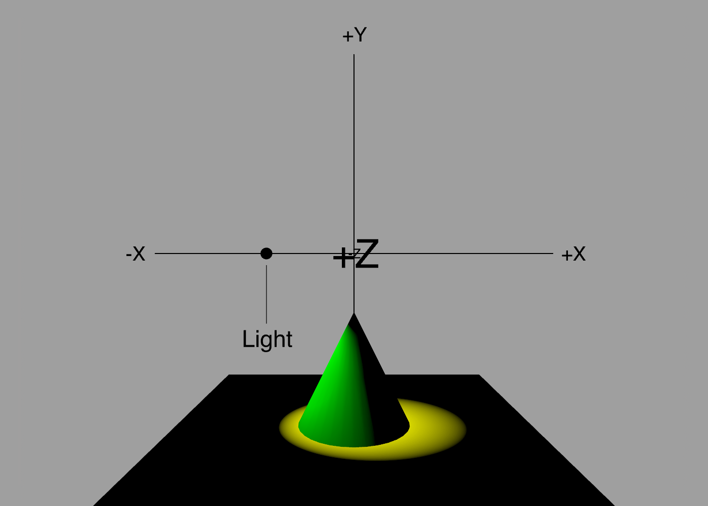
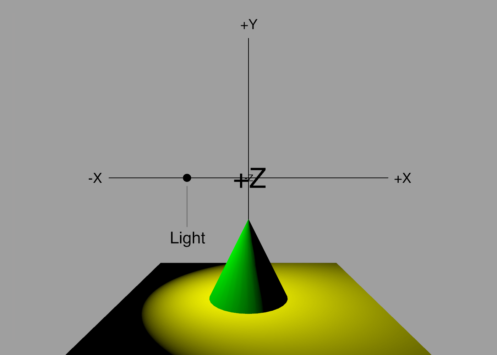
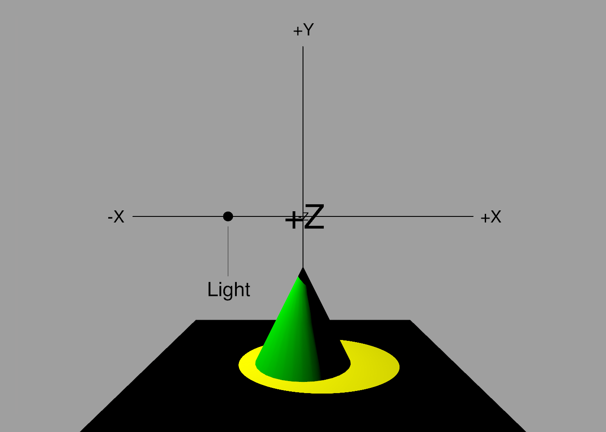

Lights
---

By default, scenes created in ShapeScript are lit with a bright, white, camera-aligned directional light. This is good for viewing purposes, but limited.

ShapeScript allows you to add your own lights to the scene, which can help produce a nicer effect when rendering a scene for display.

Lights come in four basic types, all created using the `light` command.

**Note:** there is a maximum of 8 non-ambient lights per scene. If you need more, consider pre-lighting your models using [colors](materials.md#color) or [textures](materials.md#texture).

## Ambient

An ambient light is one that illuminates all objects in the scene uniformly. It does not have a position or direction, and does not cast shadows.

To define an ambient light, add the following to your scene:

```swift
light {}
```

This creates a white ambient light at full brightness. The ambient light is applied in addition to the default lighting, with the result that the scene appears over-bright, or *washed out*:



To solve this, you can reduce the intensity of the light by setting its color:

```swift
light {
    color 0.5 // 50% intensity    
}
```

The `color` parameter of the light behaves just like any other [color](materials.md#color) in ShapeScript. You can pass up to four values representing the red, green blue and alpha components.

```swift
light {
    color 1 0 1 // purple light   
}

light {
    color #FF00FF // purple again, this time specified as a hex color literal
}
```

Alpha transparency isn't really meaningful in the context of a light source, so you can think of the fourth (alpha) component of the color as its *intensity*. In the first example above we uses a color value of 0.5 to indicate 50% intensity, but an alternative way to specify this would be to use a color with 50% alpha:

```swift
light {
    color 1 0.5 // white light with 50% intensity    
}

light {
    color #FF7F00 0.25 // orange light with 25% intensity
}
```

The advantage of this is that you can use the alpha component to vary the intensity of an arbitrary color, rather that having to calculate each component individually.

## Directional

Directional lights simulate a distant light source, like the Sun. To create a directional light, add an `orientation` component to your light:

```swift
light {
    color white
    orientation 0 0 0
}
```

An orientation of `0 0 0` (or just `0` for short) creates a light that points directly down the Z axis, and is equivalent to the default light for a front-facing camera (unlike the default lighting, this light won't move with the camera if you rotate the view however).

The three values represent the rotation around the Z, Y and X axes respectively. To create a light that shines from the left you could use:

```swift
light {
    orientation 0 0.5 0
}
```

This rotates the light by 90 degrees (`0.5 * 180`) around the vertical (Y) axis.



**Note:** unlike ambient light, adding a directional light to the scene disables/replaces the default lighting.

Lights are also affected by [relative transforms](transforms.md#relative-transforms), so the following would be equivalent to the above:

```swift
rotate 0 0.5 0
camera {
    orientation 0
}
```

**Note:** the `orientation 0` is still required, otherwise the light will be treated as ambient and will not be affected by the rotation.

## Point Lights

A point light is an omnidirectional light that exists at a particular location in space. It has a position, but no orientation:

```swift
camera {
    position -5 0 0
}
```

As you can see, the effect of placing a point light to the left of your scene is similar to a direction light facing from this direction. Unlike a directional light however, a point light can be placed in between objects in the scene:

```swift
camera {
    position 0.5 0 0
}
```



## Spotlights

A spotlight has both a position *and* direction. The following code creates a yellow spotlight located just to the left of the enter of the scene, pointing down and to the right:

```swift
light {
    color yellow
    position -0.75 0 0
    orientation -0.15 0 0.5
}
```



By default, spotlights cast light in a 45-degree cone. You can alter this with the `spread` option:

```swift
light {
    color yellow
    position -0.75 0 0
    orientation -0.15 0 0.5
    spread 0.5
}
```

The spread is a value between 0 and 1 representing a cone angle from 0 to 180 degrees, so `0.5` in the example maps to a 90-degree cone:



You've probably noticed that the edge of the light cast by the spotlight is blurred. The blurred region around the spotlight is known as the [penumbra](https://en.wikipedia.org/wiki/Umbra,_penumbra_and_antumbra#Penumbra), and can be adjusted using the `penumbra` option:

```swift
light {
    color yellow
    position -0.75 0 0
    orientation -0.15 0 0.5
    penumbra 0
}
```

The `penumbra` is specified as a value between 0 and 1 representing the proportion of the total spotlight cone that should be blurred. The default is `1` (meaning the blur is spread right across the cone). A value of zero results in a completely sharp edge:



## Debugging

Since it can be hard to visualize the position of a spot or point light, you can use the [debug command](debugging.md) to make the light temporarily visible in the ShapeScript viewer:

```swift
debug light {
    color yellow
    position -0.75 0 0
    orientation -0.15 0 0.5
}
```


---
[Index](index.md) | Next: [Cameras](cameras.md)
