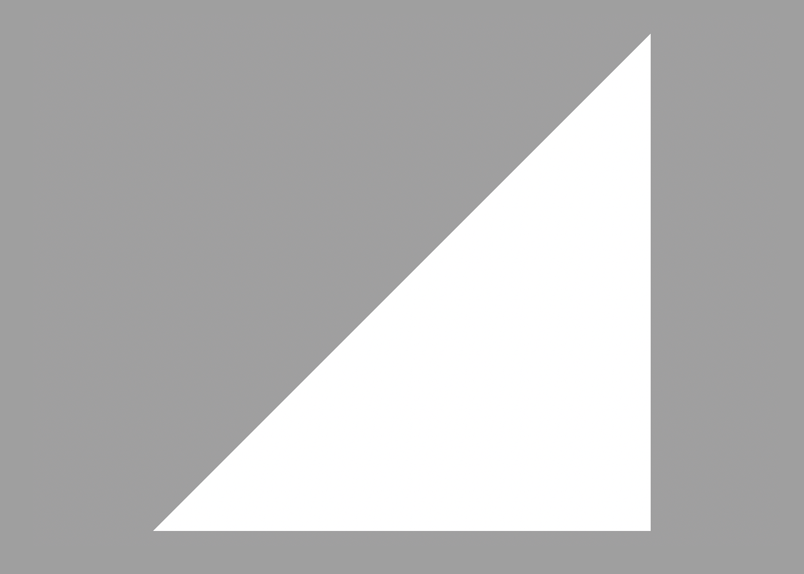
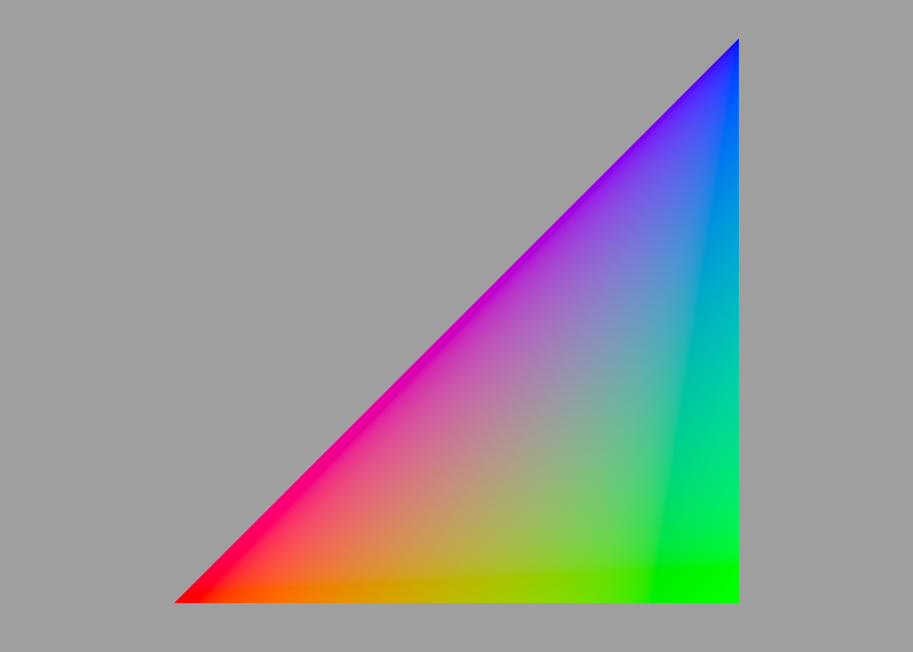
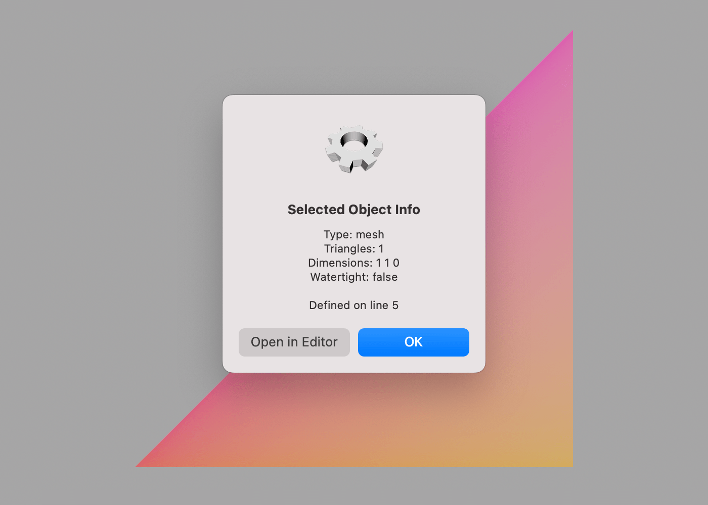
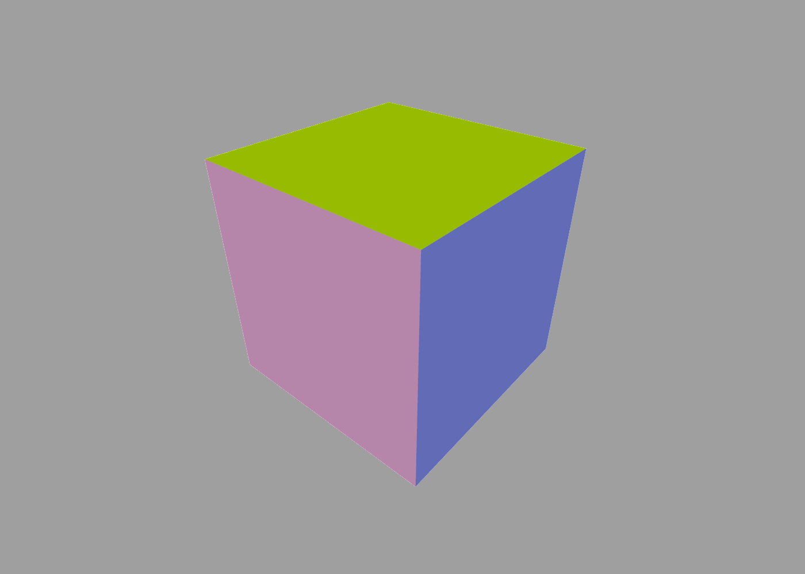

Meshes
---

While they may appear solid, the 3D shapes that ShapeScript produces are actually hollow shells composed of polygons. These polygon shells are known as [meshes](https://en.wikipedia.org/wiki/Polygon_mesh).

ShapeScript provides many tools for constructing meshes, including [primitives](primitives.md), [builders](builders.md) and [CSG](csg.md) operations, but you can also create meshes manually by specifying each polygon yourself. While this is generally a tedious approach compared to the other tools, it affords you complete control over the mesh topology, and allows you to create arbitrary shapes that might be hard to achieve with higher-level tools.

## Polygons and Points

A mesh is made up of one or more *polygons*, and each polygon is made up of three or more [vertices](https://en.wikipedia.org/wiki/Vertex_(geometry)) or *points*. To construct a mesh you use the `mesh`, `polygon` and `point` commands. The following code defines the simplest possible mesh - a single triangle:

```swift
mesh {
    polygon {
        point 0 0
        point 1 0
        point 1 1
    }   
}
```



The `point` command accepts a [vector](literals.md#vectors-and-tuples) value. Polygons can be placed anywhere in three-dimensional space, so `point` accepts up to three values (for the X, Y and Z coordinates respectively). In this case we've just specified two values, so the Z coordinate defaults to zero.

Manually constructed meshes do not currently support textures, but they inherit the current [material color](materials.md#color). Color can also be applied separately to individual vertices within a mesh. When vertices of a given polygon have different colors applied, the color will be smoothly interpolated between them, creating a gradient:

```swift
mesh {
    polygon {
        color red
        point 0 0
        color green
        point 1 0
        color blue
        point 1 1
    }   
}
```



## Watertightness

If you rotate the triangle you will see that the back face is invisible. Most of the mesh-construction commands in ShapeScript produce shapes that are *watertight*, meaning that they do not contain any holes that would allow you to see the back faces of the polygon surface, but when you create a mesh using the `mesh` command it's up to you to ensure that the mesh you create is watertight. You can check this by selecting the mesh in the editor and [getting info](getting-started.md#debugging-and-selection). As you can see, our triangle is not watertight:



Watertightness is an important quality when using [CSG](csg.md) operations, because the "solid" in Constructive Solid Geometry implies that shapes are expected to behave like solid objects (even though they are actually hollow), and holes or exposed back faces will cause glitches as ShapeScript is unable to determine whether a given point lies inside or outside the shape.

To solve this, we can add another triangle with the same vertices but facing the opposite direction. But wait - we never specified the direction of the triangle face in the first place, so how does ShapeScript decide which way a polygon is facing?

## Winding order

By convention, polygons in ShapeScript are assumed to be defined with [counterclockwise](https://en.wikipedia.org/wiki/Counterclockwise) (aka *anticlockwise*) winding. What that means is that when looking at the polygon from the front, the vertices will be ordered in counterclockwise direction. To add a back face we'll create a second triangle with the inverse vertex order:

```swift
mesh {
    // Front
    polygon {
        color red
        point 0 0
        color green
        point 1 0
        color blue
        point 1 1
    }
    // Back
    polygon {
        point 1 1
        point 1 0
        point 0 0
    } 
}
```

(We've left the back face white in this case, so you can tell which side is which). If you get info again you'll see that the triangle is now watertight:

## Procedural Meshes

We've learned how to make a triangle, but what about something a bit more complex? For our next trick we're going to create a cube.

A cube has six faces, each consisting of four vertices - 24 vertices in total. But in fact there are really only eight unique vertices, so rather than tediously typing out the same points over and over, maybe we can use the power of scripting to save ourselves some effort?

First we'll define a [block](blocks.md) called "side" that creates a single side of the cube:

```swift
define side {
    color rnd rnd rnd
    polygon {
        point -0.5 -0.5 0.5
        point +0.5 -0.5 0.5
        point +0.5 +0.5 0.5
        point -0.5 +0.5 0.5
    }
}
```

Note that the `color rnd rnd rnd` - this will produce a different random color each time the block is called, making the cube a little more interesting to look at.

Next we'll call `side` block six times from inside a `mesh`, passing a different orientation each time:

```swift
mesh {
    side { orientation 0 }
    side { orientation 0 0.5 }
    side { orientation 0 1 }
    side { orientation 0 1.5 }
    side { orientation 0 0 0.5 }
    side { orientation 0 0 -0.5 }
}
```

And voila! A colored cube:



Obviously this is a lot more trouble than just using the [cube](primitives.md#cube) command, but hopefully you can see the potential for creating more interesting shapes.

## Concave and Non-planar Polygons

In many 3D engines, meshes must be constructed exclusively from triangles. The reason for this is that by definition a triangle is always both [convex](https://en.wikipedia.org/wiki/Convex_polygon) and *planar*, meaning that all its vertices lie on the same plane, which simplifies the mathematics needed to [rasterize](https://en.wikipedia.org/wiki/Rasterisation) or render the mesh.

ShapeScript places no such restrictions on the polygons that you define in your mesh. Non-planar or non-convex polygons will be automatically split into their constituent triangles as needed for [export](export.md) or display.

---
[Index](index.md) | Next: [Paths](paths.md)

