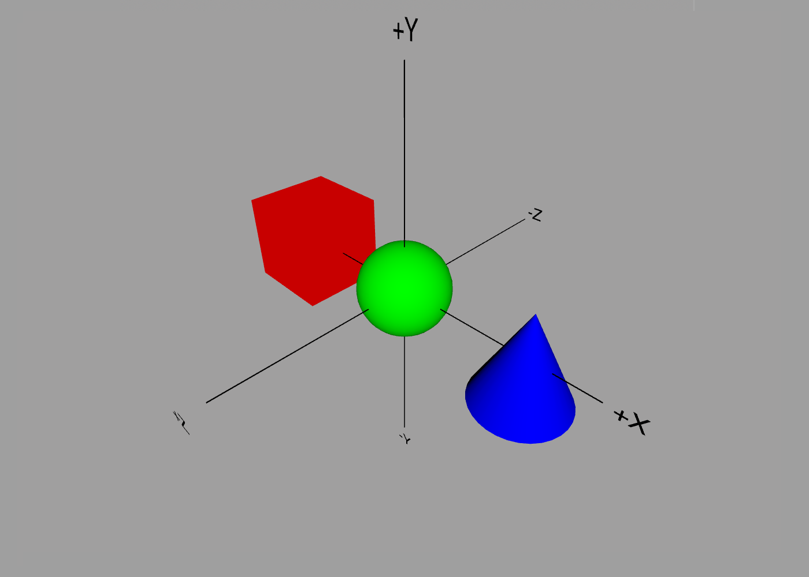
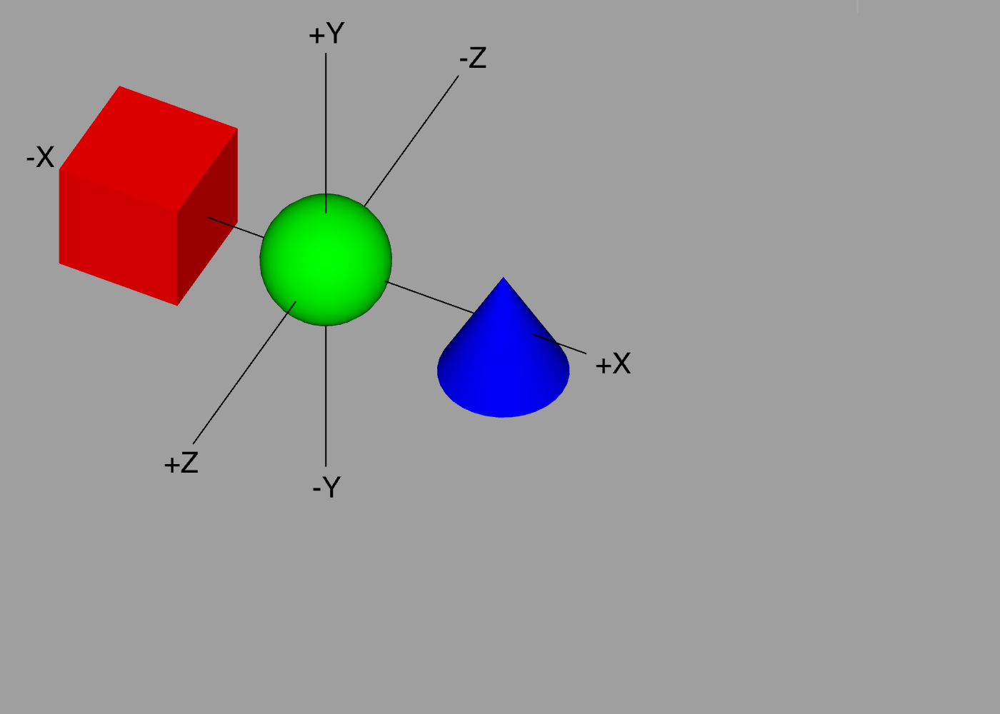

Cameras
---

ShapeScript provides a number of built-in cameras for viewing your scene from the front, back, side, etc. But you may wish to view the scene from a custom viewpoint (say, a 45-degree overhead angle).

While it is possible to reposition the view using the [camera controls](camera-control.md), it's difficult to do so in a reproducible way, which is especially important if you wish to [export](export.md) an image of your scene.

## Custom Cameras

To solve this, in addition to the built-in cameras, ShapeScript also provides a syntax for defining your own cameras. To define a custom camera, use the `camera` command:

```swift
camera
```

The location of the camera in the file is mostly unimportant - it will behave the same if it is placed before or after the visible geometry. Cameras added to your `.shape` file will appear in the camera menu below the other cameras.


You may add multiple cameras to a scene and they will be named "Custom", "Custom 2", "Custom 3", and so on. You can use the `name` command to assign a more meaningful name to a given camera, and this will be reflected in the menu:

```swift
camera {
    name "Hello"   
}
```

You can configure the camera position and orientation programmatically using the properties described below, however the easiest way to define a custom camera is to position it using the camera controls and then [copy the configuration](camera-control.md#copy-settings) and paste it into your `.shape` file.

## Position

By default the camera will be positioned just in front of the scene, but you can adjust its position using the `position` property:

```swift
camera {
    position 3 3 3   
}
```

This code creates a camera at the coordinates `3,3,3`, which is diagonally up, right, and forwards from the center of the scene. Since we have not specified otherwise, the camera will point in the direction of the center of the scene, so you might see something like this:



## Orientation

To change the orientation of the camera, and an `orientation` property:

```swift
camera {
    position 3 3 3
    orientation 0 -0.15 0.25
}
```

This rotates the camera by 27 degrees to the left (`0.15 * 180`) and 45 degrees down (`0.25 * 180`), so that it is pointing roughly at the cone:


Cameras are also affected by [relative transforms](transforms.md#relative-transforms), so the following would be equivalent to the above:

```swift
translate 3 3 3
rotate 0 -0.15 0.25
camera {
    position 0
    orientation 0
}
```

**Note:** the `position 0` and `orientation 0` here are required, because if these are not specified then the camera position and orientation will be set to their default values.
 
## Field of View

In addition to position and orientation, you can also adjust the *field of view* using the `fov` property:

```swift
camera {
    position 3 3 3
    orientation 0 -0.15 0.25
    fov 0.25
}
```

If you imagine your view as a cone expanding out from the camera, the field of view is the angle between the top and bottom edges of the cone. Like all angles in ShapeScript, it's measured in multiples of 180 degrees, so `fov 0.25` sets the field of view to 45 degrees - slightly narrower than the default of 60 degrees. This has the effect of *zooming-in* the camera:


You might think that the same effect could be achieved by simply moving the camera closer to the center of the scene, but in practice the result of this looks quite different due to the effect of perspective. To eliminate the effect of perspective, you can use an *orthographic* camera, which displays the scene without any perspective distortion.

## Orthographic View

To use an orthographic camera, you can either toggle the `Orthographic` menu (which affects all cameras), or you can set `fov` to zero or a negative value in your script, which will override the global setting.



When using an orthographic projection, the distance of the camera from an object no longer affects its size on screen. In order to control the scale at which objects appear, you can use the `size` property of the camera:

```swift
camera {
    position 3 3 3
    orientation 0 -0.15 0.25
    size 5
}
```

As with `position` and `orientation`, if the `size` property is omitted then a suitable orthographic scale will be determined automatically.

## Background

The [background color or texture](commands.md#background) for the scene can be overridden for each camera. This opens up some useful possibilities such as setting orthographic sketches as background for different cameras to use as reference images when modeling:

```swift
camera {
    name "Side View"
    position 5 0 0
    background "side-view.jpg"
}
```

## Pixel Dimensions

You can add an optional `width` and/or `height` to your camera block to control the pixel dimensions of the captured image. This has no effect on how the camera view is displayed in the app, but determines the size of [exported images](export.md#image-formats):

```swift
camera {
    width 1024
    height 768   
}
```

## Antialiasing

ShapeScript uses an *antialiasing* technique called [multisampling](https://en.wikipedia.org/wiki/Multisample_anti-aliasing) to eliminate jagged, pixelated edges around shapes. This improves the quality of the rendered image without needing to increase the output size or resolution.

Multisampling works by taking multiple color samples per pixel and blending them to prevent sudden discontinuities at pixel boundaries, but a consequence of this is that colors from the background can bleed into the edges of the foreground shape.

For this reason, when exporting images for composition onto other backgrounds it may be desirable to turn off antialiasing. You can do this by setting the `antialiased` property of the camera to `false`:


```swift
camera {
    antialiased false
}
```

---
[Index](index.md) | Next: [Comments](comments.md)
