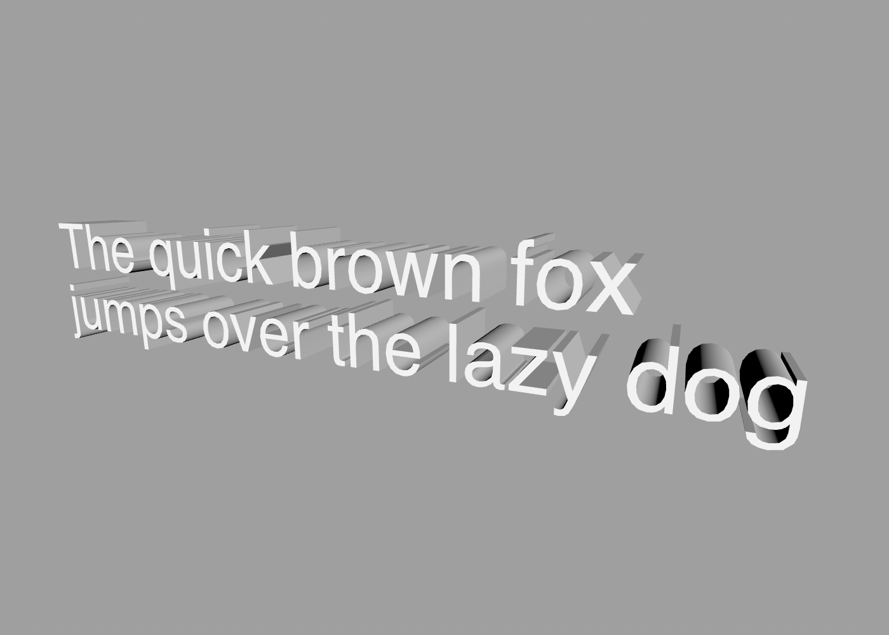
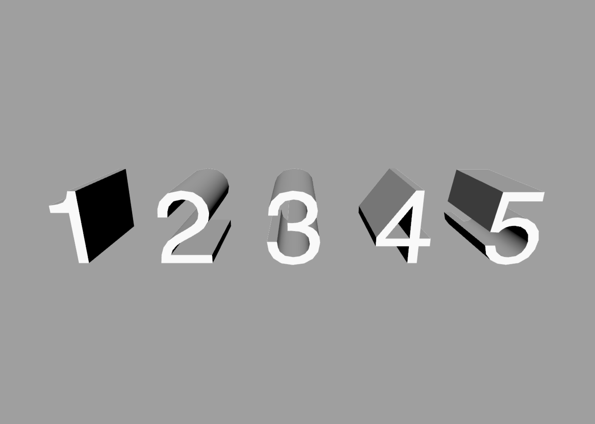
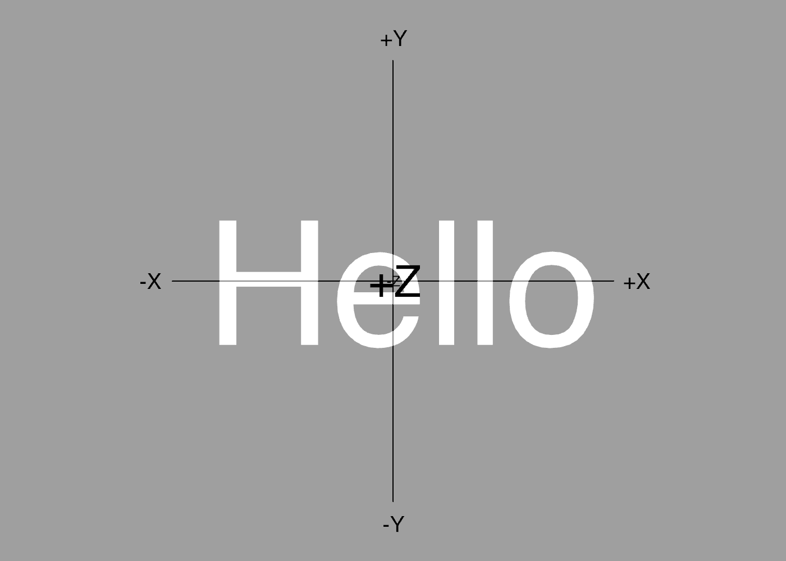
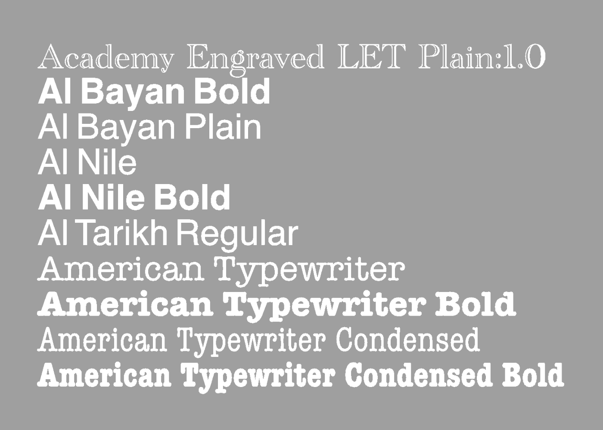

Text
---

The `text` command can be used to generate individual words, lines, or whole paragraphs of text. You use the `text` command as follows:

```swift
text "Hello, World!"
```

To create multiline text you can use the `\n` line-break sequence:

```swift
text "The quick brown fox\njumps over the lazy dog"
```

Or place each line of text on its own line within the file, surrounded by quotes:

```swift
text {
    "The quick brown fox"
    "jumps over the lazy dog"
}
```

The output of the `text` command is a series of [paths](paths.md), one for each character or *glyph* in the text:


You can use the `fill` or `extrude` commands to turn these paths into a solid mesh (see [builders](builders.md) for details):



## Interpolation

For your convenience, the text command will automatically convert numeric values to their character representation. The following displays the numbers 1 to 5 as 3D text:

```swift
for i in 1 to 5 {
    extrude text i
    translate 1
}
```



You may find that in some cases you need to compose some text dynamically from several source values. ShapeScript has a feature called [string interpolation](https://en.wikipedia.org/wiki/String_interpolation), whereby values can be inserted into a larger body of text.

To use string interpolation, simply pass multiple values to the `text` command and they will be concatenated together:

```swift
define apples 5
define pears 3
text "Bob has " apples " apples, and " pears " pears"
```

Text values are concatenated without spaces, so if you require spaces you should include them explicitly inside quotes:

```swift
text "Good" "bye" // becomes "Goodbye"
text "Hello " "World" "!" // becomes "Hello World!"
```

For your convenience, non-text values will be spaced-out automatically. If you wish to remove the spaces, you can place an empty string literal between them:

```swift
text 1 2 3 // becomes "1 2 3"
text 1 "" 2 "" 3 // becomes "123"
```

**Note:** Spaces *between* values make no difference to the output, so feel free to space them as you wish. These are all equivalent:

```swift
text "We're number "1"!"
text "We're number " 1"!"
text "We're number " 1 "!"
text "We're number "           1            "!"
```

## Wrap Width

By default, text is laid out on a single line unless you explicitly add line-breaks, either by splitting the text into multiple literals or by adding `\n` escape sequences.

But by using the `wrapwidth` option, you can force text to wrap automatically to fit a specified width. This is useful when working with programatically generated text, where it may be cumbersome to have to add logic to insert linebreaks at the right point.

```swift
text {
    wrapwidth 3
    "Hello, World!"
}
```


**Note:** `wrapwidth` is specified in world units, not characters.

## Size and Line Height

By default, text has a line height of one world unit. The line height is not the height of the actual characters, but the distance between two consecutive lines of text. If you imagine some lined writing paper, the line height would be the distance between the lines.

To adjust the text size, you can use the [size](transforms.md#size) option:

```swift
text {
    size 2 // increase text size by 200%
    "Hello, World!"
}
```

The size in this case actually refers to the line height, so setting a size of 2 increases the line height to 2 (and increases the actual size and spacing of the characters in proportion to this height).

You can resize the text non-uniformly by passing separate width and height values for the size:

```swift
text {
    size 2 1.5 // set width to 200% and height to 150%
    "Hello, World!"
}
```

Alternatively, for extruded text, you can set the size in the shape block instead, which allows you to also set the depth at the same time:

```swift
extrude {
    size 2 2 0.5 // 200% sized text, with 50% depth
    text "Hello, World!"
}
```

## Line Spacing

By default, text has a line spacing of zero, meaning that consecutive lines of text with size 1 will be spaced exactly one unit apart, with no extra padding. You can increase or decrease this line spacing using the `linespacing` property. A value of 0.5 will add an additional space of 0.5 world units between consecutive lines:

```swift
text {
    linespacing 0.5
    "Hello,"
    "World!"
}
```


A value of -0.5 will reduce the spacing by 0.5 (causing the lines to overlap by 0.5 units):

```swift
text {
    linespacing -0.5
    "Hello,"
    "World!"
}
```


## Position and Orientation

To adjust the text position and orientation, use the [position](transforms.md#position) and [orientation](transforms.md#orientation) commands:

```swift
text {
    position 2 1 // move text 2 units to the right and 1 unit up
    orientation 0.5 // rotate by 90 degrees
    "Hello World"
}
```

Or for filled or extruded text, you can set these on the containing shape block instead:

```swift
fill {
    position 1 2 3 // set the position in 3D space
    orientation 0 0.25 0 // rotate around the Y axis
    text "Hello World"
}
```

Unlike most shapes, which are positioned relative to their center, text is positioned relative to its left margin and baseline.


In order to center a piece of text, you will need to know its actual dimensions. For this you can use the [bounds](bounds.md) member property. The following code uses the bounds to center some text:

```swift
define hello text "Hello"
translate -hello.bounds.width/2 -hello.bounds.height/2
fill hello
```



## Fonts

To adjust the text font, you can use the `font` command. like `color` and other [material](materials.md) properties, `font` can be placed either inside the `text` block, or anywhere before it in the same scope:

```swift
font "Zapfino"
fill text "Hello World"
```


**Note:** Some fonts are inherently much more detailed than others, and the text may take extra time to generate. You may want to set the [detail](options.md#detail) option to a lower value for text than you would for other geometry.

The font name you provide must match a font that is already installed on your system. If no matching fonts are found then an error will be raised. To get a list of available fonts you can use the `fonts` command.

This script uses the `fonts` command to print the names of all available fonts in the [console](debugging.md#logging):

```swift
for name in fonts {
    print font.name
}
```

And this script displays the first ten font names as 3D text, with each name rendered in the appropriate typeface:

```swift
detail 8
for name in fonts[0 to 9] {
    font name
    fill text font.name
    translate 0 -1
}
```



If you wish to load a font file directly, without installing it on your system, you can pass the filename or path to the `font` command instead of the font name:

```swift
font "filename.ttf"
```

Only fonts with a ".ttf", ".otf" or ".ttc" file extension are supported. The extension is required, or the `font` parameter will be treated as a system font rather than a file. If a relative path or filename is used, it should be specified relative to the ShapeScript file that references it.

Once loaded in this way, fonts will appear in the fonts list and can be referenced by name in subsequent calls. To get the name of a font that you have loaded from a file, you can print it:

```swift
font "filename.ttf"
print font.name // Prints the actual font name, e.g. "Arial"
```

The filename can be constructed dynamically by using the [string interpolation](text.md#interpolation) feature, which is sometimes useful if, for example, you have multiple font files with a common prefix or suffix:

```swift
for n in 1 to 5 {
    texture "font" n ".ttf"
    text "Hello, World!"
    translate 0 -1 0
}
```

---
[Index](index.md) | Next: [Builders](builders.md)
