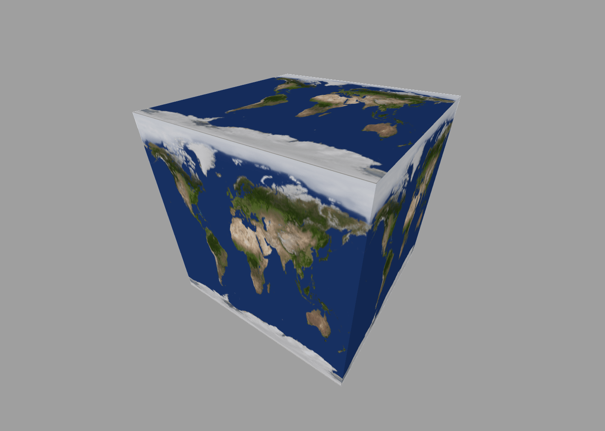
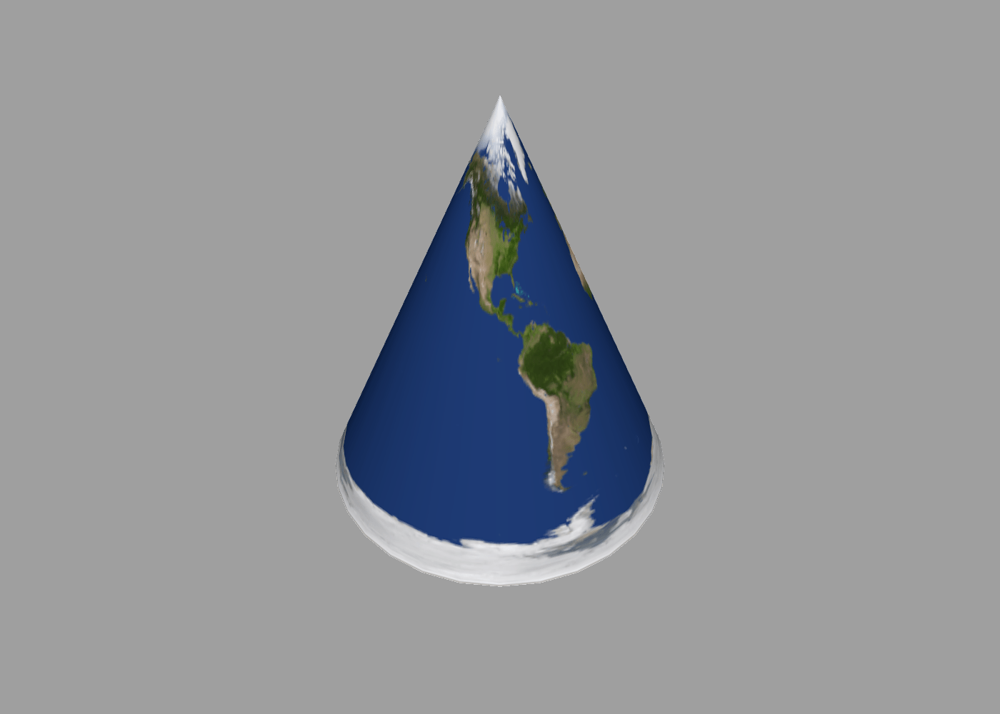

Materials
---

By default, all geometry that you create in ShapeScript appears as if it were made of a matte white plastic. You can alter this appearance using *materials*.

Materials in ShapeScript allow you to alter the [color](#color) and [texture](#texture) of a shape, as well as its physical properties such as [metallicity](#metallicity) and [roughness](#roughness), which affect how light is reflected from the surface.

## Color

You can alter the color of your shapes using the `color` (or `colour`) command, which accepts a color value in a variety of formats: Numeric RGB, hexadecimal or predefined:

The following commands all produce a red cube:

```swift
cube { color 1 0 0 }
cube { color #FF0000 }
cube { color #F00 }
cube { color red }
```

Because `color` is a command rather than an option, you can use it anywhere in your program and it will affect all subsequent shapes that you create. If you use the `color` command *inside* a shape or [group](groups.md) then its effect will end at the closing `}`:

```swift
color green
group {
    color red
    cube // red cube
}
sphere // green sphere
```

### RGB Colors

As mentioned in [Getting Started](getting-started.md), `color` can accept a tuple of up to 4 values that represent the red, green, blue and alpha color channels respectively. Values should be specified in the range 0 (no color) to 1 (full color):

```swift
color 1 0 0 // bright red
color 0.5 0 0 // a darker shade of red
color 0.5 0.5 0 // an olive green
```

The red, green and blue channels control the color itself, and the alpha channel controls transparency. An alpha of 0 is fully transparent (invisible), and an alpha of 1 is fully opaque. If omitted, the alpha value defaults to 1. Alpha values between 0 and 1 can be used to create *translucent* colors, which blend with the background behind them. The following code would produce a 50% transparent red sphere:

```swift
sphere { color 1 0 0 0.5 }
```

If fewer than 3 parameters are passed to the `color` command, the first parameter is treated as the overall luminance (brightness) value, meaning that the resultant color will be set to a shade of gray between 0 (black) and 1 (white).

The table below shows how RGBA color values are interpreted, based on the number of components:

Number of parameters         | Meaning
:--------------------------- | :--------------------------
1                            | Luminance
2                            | Luminance and alpha
3                            | Red, green and blue
4                            | Red, green, blue and alpha

<br/>

For example, the following both produce a light shade gray of gray, with a luminance of 0.8:

```swift
color 0.8
color 0.8 0.8 0.8
```

And the following both produce 50% a translucent white, with full luminance and 50% alpha :

```swift
color 1 0.5
color 1 1 1 0.5
```

### Hexadecimal Colors

Instead of numeric values, you can use web-style hex codes to specify colors. These consist of a hash character (`#`) followed by 3 or 4 pairs of hexadecimal digits to specify color components in the range 0-255. Hex color codes are a popular convention and are supported by many graphics tools. Here are some examples:

```swift
color #FF0000 // pure red
color #7F7F7F // 50% gray
color #000000 // pure black
```

As with numeric RGB colors, hex colors are opaque by default, but you can vary the alpha by adding a fourth pair of hexadecimal digits in the range `00` (fully transparent) to `FF` (fully opaque)`. A value of `7F` results in 50% transparency:

```swift
color #FF00007F // 50% transparent red
```

As with [web colors](https://en.wikipedia.org/wiki/Web_colors), you can use a three-digit "short hex" format as follows:

```swift
color #F00 // equivalent to #FF0000
```

And you can also use a fourth digit to specify alpha:

```swift
color #F006 // equivalent to #FF000066
```

### Predefined Colors

ShapeScript defines some built-in color constants for you to use:

Name      | R   G   B   | Hexadecimal | Short Hex
:---------| :-----------| :-----------| :---------
black     | 0   0   0   | #000000     | #000
blue      | 0   0   1   | #0000FF     | #00F
green     | 0   1   0   | #00FF00     | #0F0
cyan      | 0   1   1   | #00FFFF     | #0FF
red       | 1   0   0   | #FF0000     | #F00
magenta   | 1   0   1   | #FF00FF     | #F0F
yellow    | 1   1   0   | #FFFF00     | #FF0
white     | 1   1   1   | #FFFFFF     | #FFF
orange    | 1   0.5 0   | #FF7F00     | -
gray/grey | 0.5 0.5 0.5 | #7F7F7F     | -

<br/>

You can override these built-in colors using the `define` command, or define new colors of your own:

```swift
define red 1 0.3 0.1 // override the default red color with a custom shade

define lightGray 0.8 // define a new color "lightGray" with 80% luminance
```

### Alpha Override

The predefined colors are all opaque (have an alpha of 1) by default, but you can override the alpha as follows:

```swift
color red 0.5 // set color to red with 50% alpha

define greenGlass green 0.2
color greenGlass // set color to green with 20% alpha
```

This approach also works for user-defined color constants, and with RGB and hexadecimal color literals:

```swift
define skyBlue 0.5 0.8 1 // opaque blue
color skyBlue 0.5 // 50% transparent blue 

color #ff0 0.5 // 50% transparent yellow
```

## Texture

A texture is an image that is wrapped around a 3D shape, either as decoration, or to give the appearance of more surface detail than is actually there. Contrary to what the name implies, textures do not actually affect the smoothness of surface to which they are applied - they only affect its color.

You can set the texture for your shapes using the `texture` command:

```swift
sphere {
    texture "filename.png"
}
```

The parameter for the `texture` command is the name of an external image file to display. The name can include either an absolute or relative file path, enclosed in double quotes. If a relative path is used it should be specified relative to the ShapeScript file that references it.

The texture name can be constructed dynamically by using [string interpolation](text.md#interpolation), which is useful if you have multiple texture files with a common prefix or suffix:

```swift
for n in 1 to 5 {
    cube {
        texture "file" n ".png"
        position n
    }
}
```

As with `color`, once a texture has been set it will be applied to all subsequent shapes defined in the same [scope](scope.md). To clear the current texture you can set it to an empty string:

```swift
texture ""
```

**Note:** a given shape can only have either a color or texture, but not both. Setting the texture will clear the color and vice-versa.

### Access Permission

The first time you try to use an image, you will see an error screen like the one below.


This is because Apple employs a security feature called [sandboxing](https://en.wikipedia.org/wiki/Sandbox_(computer_security)) to prevent apps from accessing files without the user's permission. Use the `Grant Access` button to open the containing folder for your images. If you prefer, you can just grant access to the specific image file, but in that case you will need to grant access individually to each new texture that you use.

### Texture Wrapping

How a texture is applied depends on the shape. Different shape types have different default wrapping schemes:






Currently there is no way to override the default wrapping scheme, but the way that you create a shape affects the way that it is textured.

For example, creating a cube using the `cube` command will result in a different texture wrapping effect than creating it by [extruding](builders.md#extrude) a square.

## Normals

As mentioned above, [textures](#texture) merely give the appearance of more detail, without actually modifying the surface geometry. While this can be quite effective, if you attempt to use textures to simulate indents or protrusions then the illusion is easily shattered by changing the camera angle, revealing that the texture lacks depth.

This can be remedied through the used of another type of texture called a [normal map](https://en.wikipedia.org/wiki/Normal_mapping). The term "normal" in this context refers to [surface normals](https://en.wikipedia.org/wiki/Normal_(geometry)) - i.e. the direction facing outwards from the surface of the shape at any given point.

ShapeScript automatically generates vertex normals for your shapes, and these can be modified via the [smoothing command](commands.md#smoothing) to remove unwanted corners or add visible facets to smooth surfaces. But you can control the surface normals on a more granular level by using a *normal map*.

A normal map is an ordinary full-color texture image, except that the red, green and blue channels are interpreted as the X, Y and Z components of a normal vector respectively. Using a normal map you can specify fine details such as bumps and scratches on a surface, and ShapeScript is able to apply realistic, real-time lighting to make those details appear truly 3D (although the actual underlying geometry remains the same).

To apply a normal map, use the `normals` command and pass the name of a texture image:

```swift
cube {
    normals "cobblestones.png"
}
```

The result is shown below. On the left is the normal texture as it appears when viewed as an ordinary image. On the right is a sphere with the normal map applied using the `normals` command:


**Note:** you can combine a normal map with an ordinary texture to control both the color and lighting of a surface.

To vary the intensity of the surface perturbation, you can apply a multiplier to the texture. The following code increases the apparent depth of the stones by 2x (you can also reduce the intensity by using a fractional value):

```swift
cube {
    normals "cobblestones.png" * 2
}
```

## Opacity

Opacity is a measure of how transparent an object is. You can vary the opacity for an object or group using the alpha property of the `color` (as described [above](#color)), but sometimes you may want to vary the opacity of a whole tree of differently-colored objects, and for that you can use the `opacity` command:

```swift
opacity 0.5
group {
    color 1 0 0 // opaque red
    cube // 50% transparent red cube
    color 0 1 0 // opaque green
    sphere // 50% transparent green sphere
}
```

Setting `opacity` affects all subsequently defined objects up until the end of the current [scope](scope.md). The `color` or `texture` of each object is multiplied by the current `opacity` value, so a `color` with alpha 0.5 combined with an `opacity` of 0.5 will result in the object being drawn with an overall opacity of 0.25.

Opacity is applied hierarchically. The value you specify with the `opacity` command is multiplied by the value set in the parent scope, so drawing an object with `opacity` 1.0 inside a scope with `opacity` 0.5 will result in in an opacity of 0.5, not 1.0, because the inner value is relative to the outer value.

As with the alpha property of `color`, `opacity` is measured in the range 0 (fully transparent) to 1 (fully opaque), however you can specify `opacity` values higher than 1. This can be useful for making an object *more* opaque than the base level for its current scope. For example, by setting `opacity` to 1 / [the parent scope opacity], you can cancel it out:

```swift
opacity 0.5
group {
    color 1 0 0 // opaque red
    cube // 50% transparent red cube
    color 0 1 0 // opaque green
    opacity 2 // cancel out the 50% opacity
    sphere // opaque green sphere
}
```

The `opacity` property can be set to a texture (image) instead of a simple number by providing the name of an external image file:

```swift
sphere {
    opacity "checkerboard.png"
}
```


Using an opacity texture allows you to create surfaces with variable transparency, such as a window with an opaque frame. Only the alpha channel of the texture image is used to compute the transparency.

## Glow

Materials in ShapeScript are affected by scene lighting, but sometimes you might want to model something like a lightbulb that appears to glow with its own light. You might be tempted to use a [light source](lights.md) for this, but that probably won't produce the effect you want because lights themselves are invisible, and placing a light inside a translucent shape will only illuminate the objects around it.

Instead you can use the `glow` material property. The `glow` property accepts a color or texture argument. Glow works in a similar way to [opacity](#opacity), where you can pass either an intensity value in the range 0 to 1, or a texture if you want a non-uniform brightness:

```swift
glow 0.5 // 50% brightness
```

Unlike `opacity` however, `glow` can accept color values, so for example the following would produce a bright red glow:

```swift
glow red
```

The alpha channel is ignored, so if you wish to vary the brightness of a colored glow, the easiest way is to multiply the color by a constant. This would emit a green glow at 50% brightness:

```swift
glow green * 0.5
```


**Note:** glowing materials do not illuminate other objects in the scene. To get the effect of a glowing light bulb that actually lights the scene, you can combine a glowing material with a [point light](lights.md#point-lights) located nearby.

## Metallicity

Metallicity (sometimes called "metallicness" or just "metalness") is used as part of a [Physically Based Rendering](https://en.wikipedia.org/wiki/Physically_based_rendering) (PBR) shading pipeline designed to give a realistic appearance to your shapes. Setting either or both of the metallicity and [roughness](#roughness) properties will enable the PBR shader for all subsequent shapes in the current scope.

As the name implies, metallicity controls how *metallic* the material is. A value of 1 means completely metallic and a value of 0 means not metallic at all. Values in between might be used for metal materials covered with paint or dirt that reduces their sheen:

```swift
metallicity 0.9
```


The `metallicity` property can be set to a texture (image) instead of a simple number by providing the name of an external image file:

```swift
metallicity "weathered-metal.png"
```

Using a metallicity texture allows you to create composite surfaces that are only partly metallic, or which have patches of rust, dirt or paint that reduce the shininess. Since metallicity is a scalar rather than color property, the texture should be in grayscale. If a full-color image is supplied, only the red channel will be used.

As with the [normal map](#normals) above, you can apply a multiplier to the metallicity texture to vary its overall intensity:

```swift
metallicity "weathered-metal.png" * 0.5 // half as metallic
```

## Roughness

The `roughness` property counteracts the shininess applied by the [metallicity](#metallicity) property by simulating surface scratches or texture. This doesn't completely negate the effect of metallicity, but it can be used to create surfaces that are recognizably both metallic and also non-smooth, like an old scratched-up piece of iron:

```swift
roughness 0.7
```

As with the [metallicity](#metallicity) property, `roughness` is specified in the range 0 to 1, but can also be set to a texture image in order to apply non-uniform roughness.

## Material

It is sometimes convenient to be able to group a set of related material properties together and set them all at once rather than individually. You can define a collection of material properties and assign them to a [symbol](Symbols.md) by using the `material` command:

```swift
define redMetal material {
    color red
    metallicity 1
}
```

Your custom material can then be re-applied at any time by using the `material` command again and passing your previously-defined symbol:

```swift
material redMetal // set material for all subsequent shapes in this scope

sphere {
    material redMetal // set material for just this shape
}
```

You can also get the material of an existing shape using its `material` [member](expressions.md#members) and then apply it to another shape:

```swift
define greenSphere sphere {
    color green
    metallicity 0.5
    glow 0.2
}

cube {
    material greenSphere.material
}
```

---
[Index](index.md) | Next: [Transforms](transforms.md)
