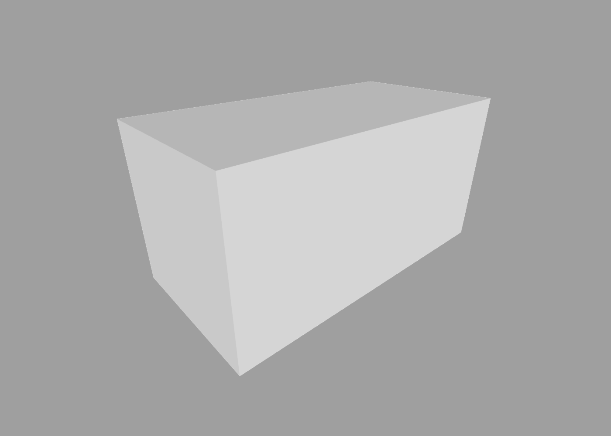
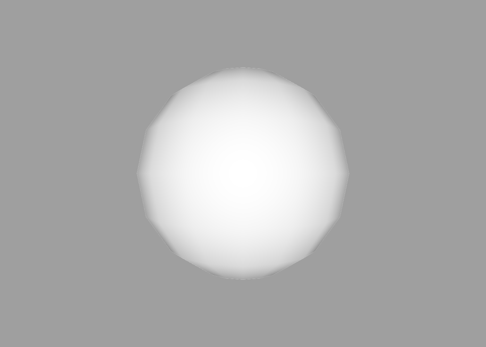
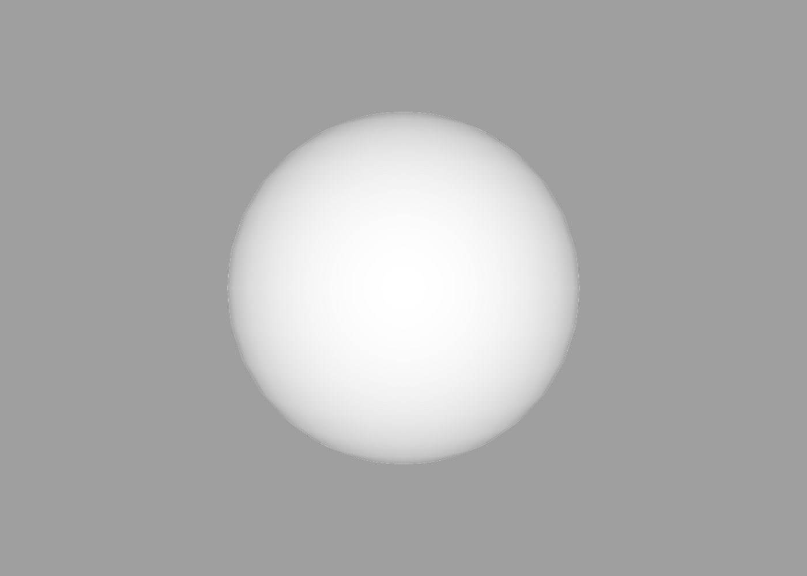
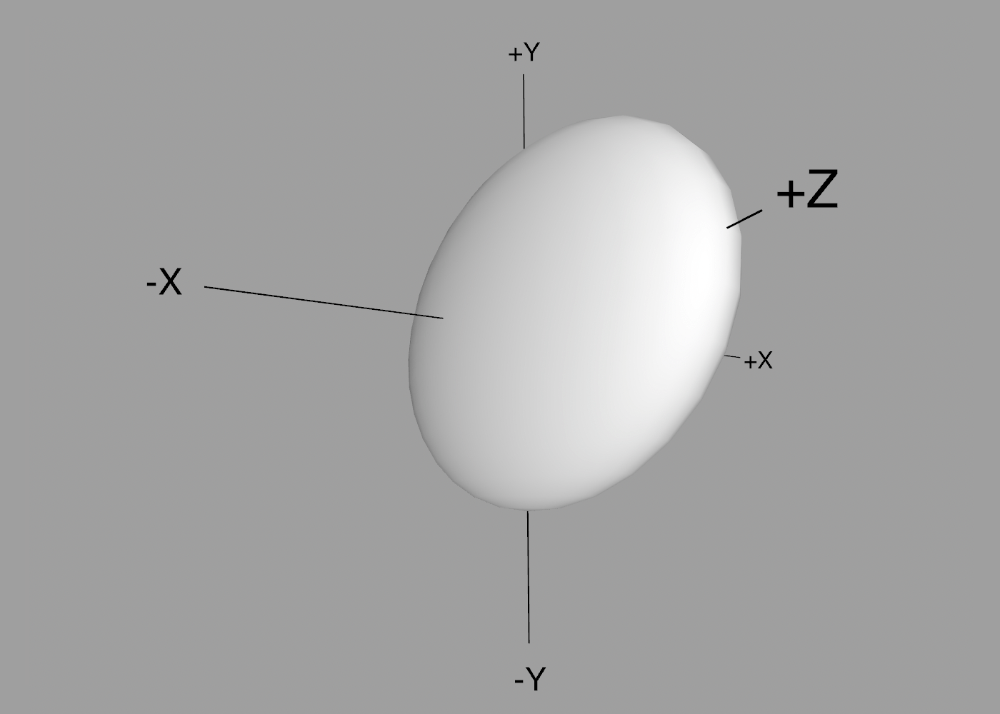
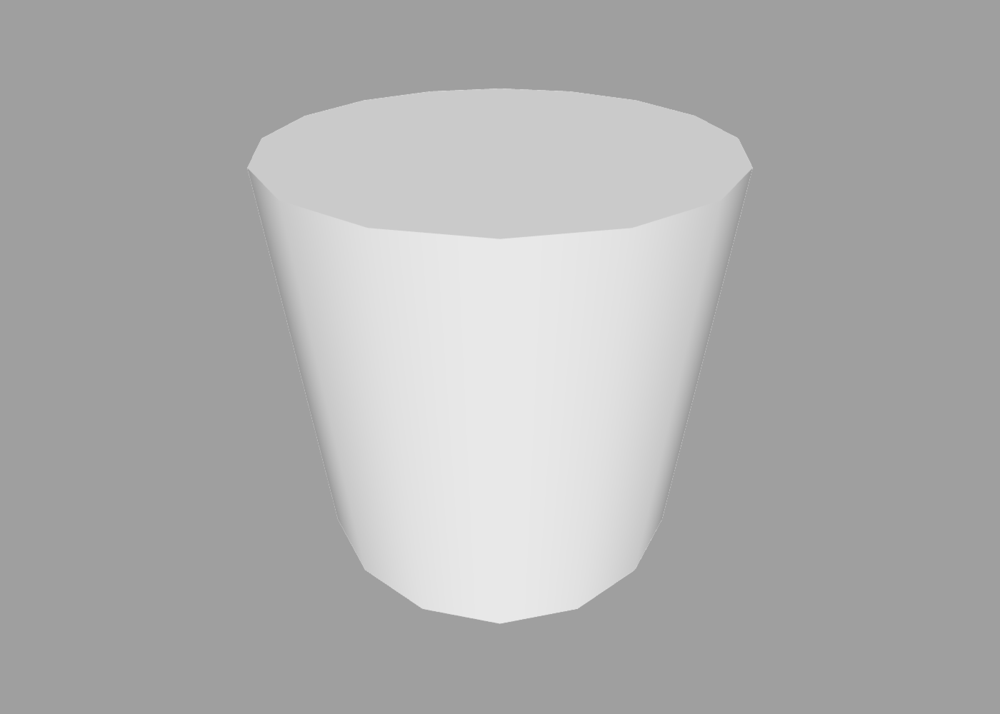

Primitives
---

ShapeScript has a number of built-in shapes that you can use to quickly construct a scene. These are known as *primitives*, to distinguish them from more complex custom shapes that you can define using [builders](builders.md) or [CSG](csg.md) operations.

## Cube

The `cube` primitive creates a box. You can create a cube just by using the `cube` command, which defines a cube with the default size of one unit:

```swift
cube
```

To alter the size of the cube, you can pass a [block](blocks.md) containing a `size` option followed by up to 3 values specifying the individual dimensions of the cube, or a single value to create a cube with equal sides.

```swift
cube { size 1 2 }
```



You can also rotate and position the cube using the `orientation` and `position` options, as follows:

```swift
cube {
    size 1 1 2
    position 1 0 0
    orientation 0.25
}
```

The `size`, `position` and `orientation` options are common to all shapes. For more information about these (and other) options, see the [options](options.md) section.

## Sphere

The `sphere` primitive creates a spherical ball. Again, `size` can be used to control the diameter. The following creates a sphere with a diameter of 1 unit (which is the default).

```swift
sphere { size 1 }
```



You may notice that the sphere doesn't look very smooth. As mentioned in the [getting started section](getting-started.md), 3D shapes in ShapeScript are made up of polygons, so curves cannot be represented exactly, only approximated.

You can improve the quality of the sphere by using the `detail` option:

```swift
sphere {
    detail 32
    size 1
}
```



You can also pass multiple parameters to `size` to create a *spheroid*:

```swift
sphere {
    detail 32
    size 1 2 3
}
```



## Cylinder

The `cylinder` primitive creates a flat-ended cylinder. 

```swift
cylinder { size 1 }
```



Like the `sphere` primitive, `cylinder` uses the `detail` command to control its smoothness. If you require a cylinder that is longer or shorter, you can pass a second parameter to the `size` to control the diameter and length independently:

```swift
cylinder {
    detail 64
    size 1 2
}
```

## Cone

The `cone` primitive creates a conical shape:

```swift
cone { size 1 }
```


Like `sphere` and `cylinder`, its smoothness is controlled by the `detail` command, and the diameter and length can be controlled independently by passing additional parameters to `size`:

```swift
cone {
    detail 48
    size 1 2
}
```

---
[Index](index.md) | Next: [Options](options.md)
