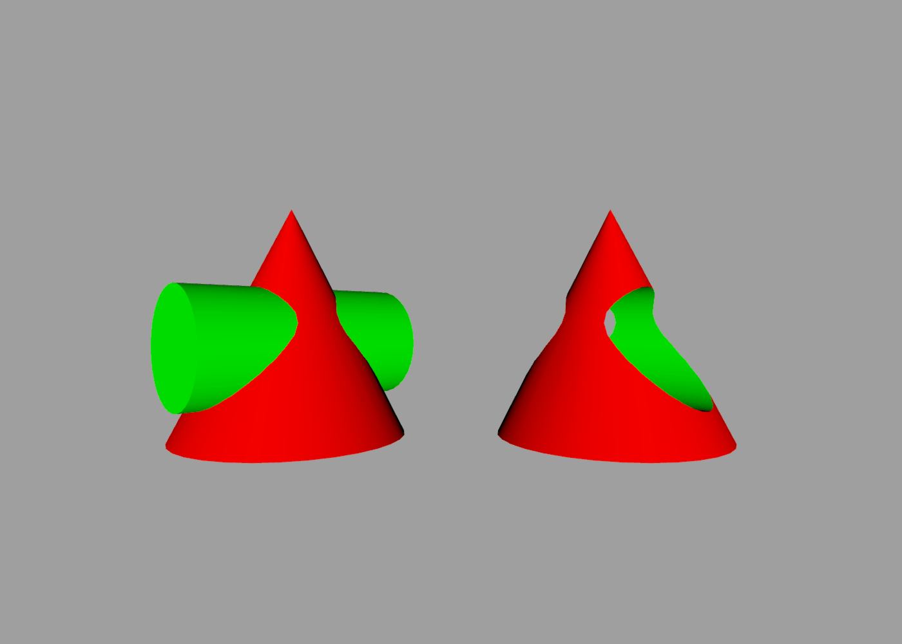

Constructive Solid Geometry
---

Constructive Solid Geometry (CSG) is a process by which solid shapes can be combined or subtracted from one another to create shapes that would be hard to model directly.

There are four basic types of CSG command in ShapeScript:

## Difference

The `difference` command takes 2 or more child meshes and subtracts them from one another. In this example, a green-colored cylinder is subtracted from a red cone:

```swift
difference {
    cone {
        color 1 0 0
    }
    cylinder {
        position 0 -0.1 0
        orientation 0.5
        size 0.5 1
        color 0 1 0
    }
}
```

The result is shown below on the right. The shape on the left is using a `group` instead of `difference`, so you can see the position of the cylinder prior to subtraction.



The subtracted shape is removed from the result, but leaves an impression in the shape it is subtracted from. You can see this in above image, where the hole in the red cone is lined with green coloring from the cylinder.

## Intersection

The `intersection` command returns a shape representing the common volume between all input shapes. You can think of it as being like the *AND* function from boolean algebra.

If we change the `difference` to an `intersection` in the previous code sample, this is the result:


As before, the color is taken from the shape that originally contributed that part of the surface.

## Union

The `union` command merges its child meshes into a single shape. You can think of it as being like the *OR* function from boolean algebra.

For an opaque shape the result is not visually distinguishable from simply using a `group`, but below the surface the `union` will split intersecting polygons and remove internal faces so that only the outer shell remains.

This can be important for rendering efficiency, as well as producing more predictable results if the mesh is then used for additional CSG operations.

The effect can be seen by using a translucent color (one with an alpha component less than one). In the image below, the red cones have been set to an alpha opacity of 0.75, with the green cylinders left fully opaque.

The shape on the left is using a `group`, and the inner surface of the cylinder can clearly be seen through the surface of the cone. The shape on the right is using `union` and so the part of the cylinder inside the cone cannot be seen (because it has been removed).


## XOR

The `xor` command (short for *Exclusive-OR*) combines its child objects using the [even-odd rule](https://en.wikipedia.org/wiki/Even–odd_rule). For example, two overlapping cylinders will produce an eye-shaped hole where the volumes intersect:

```swift
xor {
    cylinder {
        color 1 0 0
    }
    cylinder {
        position 0.5
        color 0 1 0
    }
}
```


## Stencil

The `stencil` command retains the shape of its first child, but "paints" the intersecting areas between the child shapes using the material of the other children. This can be used to apply logos or patterns to the surface of a shape.

In the following example, a red ball has been stenciled with the pattern of a green square:

```swift
stencil {
    // ball
    sphere { color 1 0 0 }
    // square
    cube {
        color 0 1 0
        size 0.4
        position 0 0 0.5
    }
}
```


**Note:** If the stencil shape has a texture applied to it (see [Materials](materials.md#texture)) then the texture wrapping will match the coordinates of the shape being painted, not the shape that the texture is taken from.

If the child shapes both have the same color or texture, there will be no visible effect from using stencil.

---
[Index](index.md) | Next: [Groups](groups.md)
