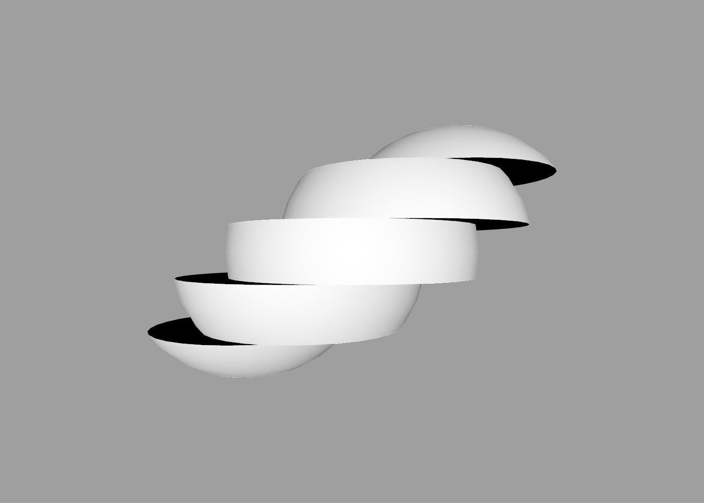

Functions
---

Functions consist of a name followed by one or more values. They perform an operation on their input values and return the result.

Functions can be used inside expressions, and can accept expressions as inputs. Unlike [operators](expressions.md#operators), functions have no implicit precedence, so parentheses may be needed to avoid ambiguity.

In the following example, it's not clear if `y` is intended as a second argument to the `cos` function, or as the second argument to the translate command. Only the latter would technically be valid, since `cos` only accepts a single argument, but ShapeScript requires you to be explicit, and will treat this as an error:

```swift
translate cos x y
```

The error can be resolved by using parentheses to group the `cos` function with its argument:

```swift
translate (cos x) y
```

Lisp programmers will find this syntax quite familiar, but if you have used C-like programming languages it may seem a little strange to put the parentheses around the function name and its arguments instead of just the arguments. If you prefer, you can use a C-like syntax instead:

```swift
translate cos(x) y
```

Either approach is acceptable in ShapeScript.

## Arithmetic

In addition to the standard arithmetic [operators](expressions.md#operators), ShapeScript also includes a number of built-in arithmetic *functions*:

The `round` function is used to round a number to the nearest integer (whole number):

```swift
round 3.2 // returns 3
round 3.9 // returns 4
round 3.5 // returns 4
```

The  `floor`  function is similar, but always rounds down:

```swift
floor 3.2 // returns 3
floor 3.9 // returns 3
```

The  `ceil`  function always rounds up:

```swift
ceil 3.2 // returns 4
ceil 3.9 // returns 4
```

The `abs` function returns the magnitude of a number, ignoring the sign:

```swift
abs 4.5 // returns 4.5
abs -51 // returns 51
```

The `sign` function (not to be confused with [sin](#trigonometry)) returns `1`, `-1` or `0` depending on the sign of the input:

```swift
sign 4.5 // returns 1
sign -51 // returns -1
sign 0 // returns 0
```

The `sqrt` function returns the square root of a value:

```swift
sqrt 4 // returns 2
sqrt 2 // returns 1.414
```

The `pow` function takes *two* parameters, and return the first value raised to the power of the second:

```swift
pow 2 4 // returns 16
pow 3 2 // returns 9
pow 4 0.5 // returns 2
```

The `min` function returns the lower of two or more values:

```swift
min 2 4 // returns 2
min 5 0 -5.1 // returns -5.1
```

The `max` function returns the higher of two or more values:

```swift
max 2 4 // returns 4
max 5 0 -5.1 // returns 5
```

## Linear Algebra

ShapeScript also includes functions for operating on [vectors](literals.md#vectors-and-tuples):

The `dot` function is used to calculate the [dot product](https://en.wikipedia.org/wiki/Dot_product) of a pair of vectors:

```swift
define up (0 1)
define right (1 0)
print dot(up right) // returns 0
```

The `cross` function calculates the [cross product](https://en.wikipedia.org/wiki/Cross_product):

```swift
define up (0 1)
define right (1 0)
print cross(up right) // returns 0 0 -1
```

The `length` function calculates the magnitude of a vector (also known as the [norm](https://en.wikipedia.org/wiki/Euclidean_space#Euclidean_norm)):

```swift
define v (3 4)
print length(v) // returns 5
```

The `normalize` function computes a [unit vector](https://en.wikipedia.org/wiki/Unit_vector) from an arbitrary vector by dividing each element by the vector length:

```swift
define v (3 4)
print normalize(v) // returns 0.6 0.8
```

The `sum` function returns the sum of two or more values. It works with both scalar and vector inputs:

```swift
sum 2 4 // returns 6
sum 5 0 -5.1 // returns -0.1
sum (1 2 3) (4 5 6) // returns (5 7 9)
```

## Trigonometry

For the most part, you can avoid the need for trigonometry in ShapeScript by using the built-in [transform commands](transforms.md#relative-transforms) to manipulate geometry rather than manually calculating the positions of vertices.

But sometimes you may wish to do something more complex (e.g. generating a path in the shape of a sign wave) that can only be achieved through explicit calculations, and to support that, ShapeScript provides a standard suite of trigonometric functions.

While ShapeScript's [transform](transforms.md#orientation) commands expect values in [half-turns](https://en.wikipedia.org/wiki/Turn_(angle)), the trigonometric functions all use [radians](https://en.wikipedia.org/wiki/Radian).

For example, the `sin` (sine) function takes a radian representation of an angle and returns a ratio value of that angle. In this case 0.524 radians returns 0.5 or 1/2 - an angle of 30 degrees:

```swift
sin 0.524 // returns 0.5
``` 

The `acos` (arc cosine) function takes a ratio representation of an angle and returns a radians value of that angle. In this case 1/2 or 0.5 returns 1.047 radians - equivalent to an angle of 60 degrees:

```swift
acos 0.5 // return 1.047
``` 

The `cos` (cosine), `sin` (sine), and `tan` (tangent) functions all take a radians value and return a ratio value, and the `asin` (arc sine), `acos` (arc cosine), and `atan` (arc tangent) functions all take a ratio value and return a radians value.

Using `atan` to calculate the angle of a vector is problematic because the result that it returns can be ambiguous. You need to take the vector quadrant into account, as well as the ratio of the X and Y components.

The `atan2` function works like `atan`, but instead of a single tangent value, it accepts separate Y and X inputs and returns the angle of the vector that they describe. The resultant angle correctly takes the vector quadrant into account.

```swift
atan2 1 -1 // returns a radian angle of the vector Y: 1, X: -1
```

To convert an angle in radians to a ShapeScript half-turn value, divide it by the 'pi' constant:

```swift
define angle acos(0.5) // returns 1.047 radians (60 degrees)
rotate angle / pi      // return 0.333 (1.047 / 3.141)
```

To convert a ShapeScript half-turn value to radians, multiply it by `pi`.

```swift
cube {
    orientation 0.5
    print orientation.roll * pi // prints 1.571 (0.5 * pi)
}
```

Angular conversion formulae:

Conversion            | Formula
:---------------------| :--------------------------
Degrees to radians    | radians = degrees / 180 * pi
Radians to degrees    | degrees = radians / pi * 180
Degrees to half-turns | halfturns = degrees / 180
Half-turns to degrees | degrees = halfturns * 180
Radians to half-turns | halfturns = degrees / pi
Half-turns to radians | radians = halfturns * pi

<br>

Common values:

Angle in degrees | Angle in radians | Angle in half-turns 
:--------------- | :--------------- | :------------------
0                | 0                | 0
30               | pi / 6 (0.524)   | 1 / 6 (0.167)
45               | pi / 4 (0.785)   | 1 / 4 (0.25)
60               | pi / 3 (1.047)   | 1 / 3 (0.333)
90               | pi / 2 (1.57)    | 1 / 2 (0.5)
180              | pi     (3.142)   | 1

<br>

## Strings

ShapeScript includes a number of functions for manipulating strings.

The `join` function concatenates two or more strings together, with an optional separator:

```swift
define words "Hello" "World!"
define greeting join words ", "
print greeting // prints "Hello, World!"
```

If you don't want a delimiter, just pass an empty string as the second argument to join:

```swift
define words "Hello" "World!"
define greeting join(words "")
print greeting // prints "HelloWorld!"
```

The `split` function breaks a string up into a tuple of substrings by splitting it at a specified delimiter:

```swift
define input "comma,delimited,string"
define elements split input ","
print elements.second // prints "delimited"
```

The `trim` function removes any leading or trailing [white space](https://en.wikipedia.org/wiki/Whitespace_character) characters from a string:

```swift
define input "comma, delimited , string,with ,spaces"
define elements split input ","
print elements.second // prints " delimited "
print trim elements.second // prints just "delimited" without spaces
```

## Functions and Expressions

Expressions can be passed as function arguments, for example:

```swift
sin pi / 2 // returns 1
```

Which, thanks to precedence rules, is equivalent to:

```swift
sin(pi / 2) // returns 1
```

You can also use function calls *inside* an expression, for example:

```swift
print (sqrt 9) + (sqrt 9) // prints 6
```

Or the equivalent form of:

```swift
print sqrt(9) + sqrt(9) // also prints 6
```

**Note:** When used inside an expression, parentheses around the function (or just its arguments) are required.

## Custom Functions

You can define your own functions using the `define` command. A function definition consists of a function name followed by a list of parameter names in parentheses:

```swift
define sum(a b) {
    a + b
}

define degreesToRadians(degrees) {
    degrees / 180 * pi
}
```

Like [blocks](blocks.md), functions can refer to constant values or other functions defined in their containing [scope](scope.md):

```swift
define epsilon 0.0001

define almostEqual(a b) {
    abs(a - b) < epsilon
}
```

**Note:** Unlike [block options](blocks.md#options), function parameters do not have default values. Calling a function without passing a value for every parameter will result in an error.

ShapeScript uses [type inference](https://en.wikipedia.org/wiki/Type_inference) to raise an error if the caller passes values of a different type than the function expects.

Function parameters can be any type, including paths and meshes. Here is a function that splits a shape into horizontal slices:

```swift
// function to split a mesh into slices
define split(shape slices) {
    define axis 0 1 0 // y-axis
    define offset shape.bounds.center
    define shapeSize shape.bounds.size
    define step shapeSize / slices
    for i in 1 to slices {
        difference {
            shape
            cube {
                size shapeSize
                position offset + axis * i * step
            }
            cube {
                size shapeSize
                position offset + axis * ((i - 1) * step - shapeSize)
            }
        }
    }
}

// split a sphere into 5 slices
define result split(sphere 5)

// display the result
for slice in result {
    slice
    translate 0.2
}
```



---
[Index](index.md) | Next: [Commands](commands.md)
