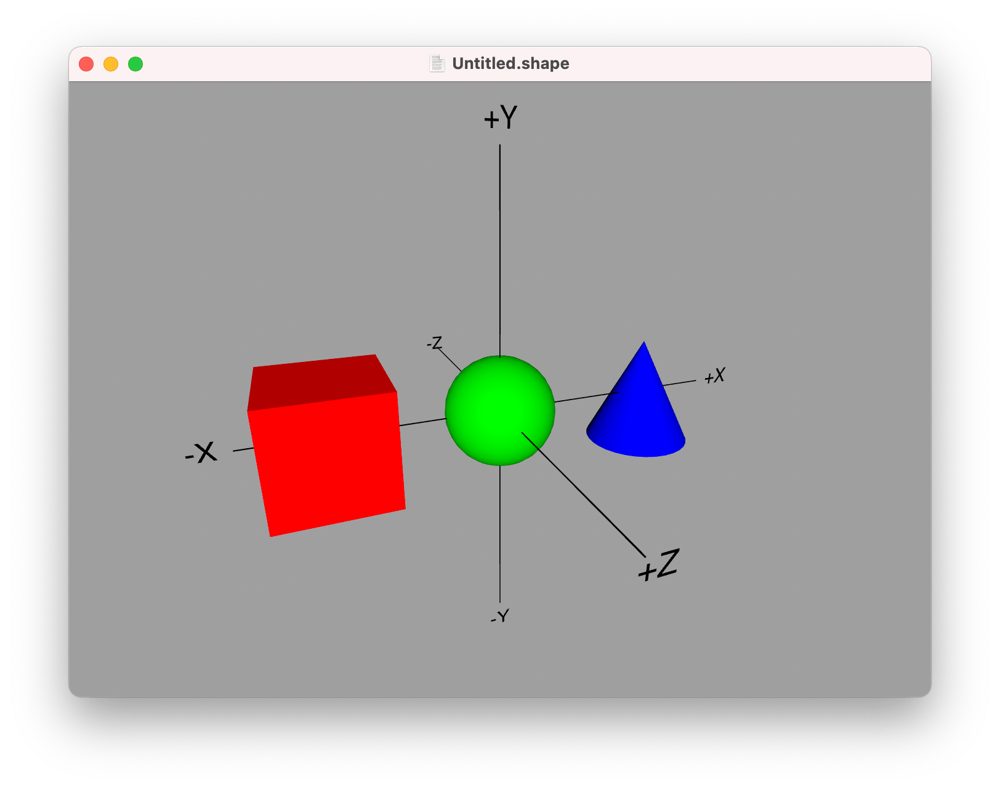
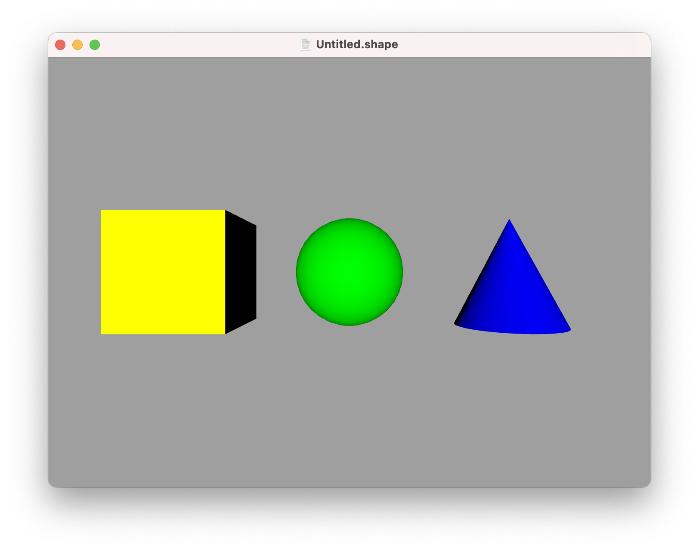
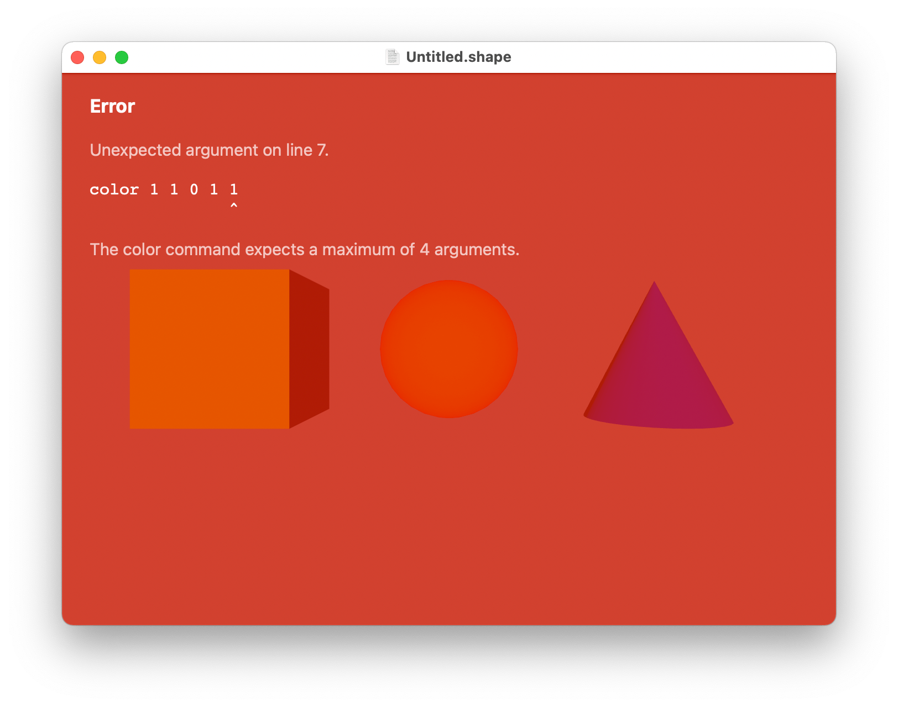

Getting Started
---

Start by creating a new ShapeScript document. You can do this by selecting `File > New` in the menu bar (or by pressing **Cmd-N** on the keyboard). You will be prompted to select a name and location for your new file - you can call it anything you want, but be sure to retain the `.shape` file extension.

You should see a new window appear containing a cube, sphere and cone. These are the default contents for a new file (don't worry, you can replace them with your own shapes).


## Viewing

Drag your mouse cursor inside the window and you will notice that the three objects appear to rotate.

You are not actually moving the shapes themselves, but rotating the camera around them. To reset the view, select `View > Camera > Reset` or press **Cmd-0**.

To help you orient yourself, you can use the `View > Show Axes` option, which displays the direction of the X, Y and Z axes.



For more information about navigating around the model, see [Camera Control](camera-control.md).

## Editing

To edit the 3D model, select the `Edit > Open in Editor` menu or press **Cmd-E**.

ShapeScript does not include an editor. Instead, the `Open in Editor` command will ask you to select an external text editor to use. If you do not have any other editors installed, the default option will probably be TextEdit. Once opened, the file should look something like this:


ShapeScript files are just ordinary text documents, so they can be opened in any program that supports editing text. TextEdit will work, but is probably not the best choice as it does not support syntax coloring or any of the other programmer-friendly features of modern editors.

If you have a more advanced editor such as [SubEthaEdit](https://subethaedit.net), [TextMate](https://macromates.com), [Sublime Text](https://www.sublimetext.com) or [Atom](https://atom.io) then it would be better to use one of these. An Integrated Development Environment (IDE) such as [Xcode](https://developer.apple.com/xcode/) is also a good option.

No third-party editors currently support ShapeScript syntax directly, but if you set your editor to treat `.shape` files as another C-like language (e.g. C, Swift or Java) then it should do an acceptable job of syntax coloring and indenting. Some editors (such as Xcode) will make this association automatically, which will save you having to do it each time you edit a ShapeScript file.

ShapeScript will only ask you which editor you want to use the *first* time you edit a file, then it will remember your choice. If you change your mind later, you can select a different editor in Preferences (select the `ShapeScript > Preferences…` menu or press **Cmd-,**).

When using an external editor it can be useful to have the rendered model visible in the same workspace, so that you do not have to use split-screen or switch applications to see the results of your changes. Toggle the `Window > Keep in Front` menu item or press **Cmd-Shift-F** to keep the focused ShapeScript window in front when you switch to another application.

## File Structure

The first line of the default `.shape` document looks like this:

```swift
// ShapeScript document
```

Lines beginning with `//` are comments, and are ignored by the parser. You can use these comments to document what the different parts of your file are doing.

The next line is:

```swift
detail 32
```

This controls the level of detail used for shapes in the file. ShapeScript models are made out of flat polygons, so it is not possible for curved edges to be represented exactly. When you define a sphere or other curved shape, the `detail` value is used to decide how many polygons will be used.

Next we have the following:

```swift
cube {
    position -1.5
    color 1 0 0
}
```

These three lines (ignoring the closing `}`) represent three distinct instructions, although they are grouped together because they all relate to a single shape. White space (such as spaces, tabs, or blank lines) is mostly ignored, however each new instruction must be placed on a new line.

The first instruction, `cube`, creates the cube shape. Note the `{ ... }` braces after `cube`. Content inside braces relates to the instruction that precedes them. In this case, the braces contain instructions that set the  `position` and  `color` of the cube.

The line `position -1.5` means "position the shape 1.5 spacial units to the left of the origin". The *origin* is the center of the world, and is the default position at which new shapes will appear.

**Note:** The spacial units ShapeScript uses are arbitrary, and can represent anything that you wish them to: a centimeter, a meter, an inch, a mile, etc. Try to choose an appropriate scale for your models so that you avoid having to work with very large scales (thousands of units), or very small scales (thousandths of a unit). That will help to avoid rendering precision issues, as well as making your scripts easier to work with.

The `position` keyword is followed by up to 3 numbers representing offsets along the X, Y, and Z axes respectively. If values are omitted, they are assumed to be zero, so a position o-f `-1.5` is equivalent to `-1.5 0 0`. This is covered in detail in the [transforms](transforms.md#position) section.

The next line, `color 1 0 0` sets the current color. The three numbers after the keyword represent the red, green, and blue color channels, each with a range from 0 to 1. Because the red channel is 1 and the other channels are 0, the resultant color will be pure red.

As with `position`, you can omit values for the `color`, but the behavior is slightly different: If you only specify one value then that will be used for all three color channels. You can optionally specify a fourth "alpha" value to control transparency. This is covered in detail in the [materials](materials.md#color) section.

The groups of instructions after the cube are similar, but define a sphere and cone respectively.

## Next Steps

Change the `color 1 0 0` instruction to `color 1 1 0`, and then save the file. If you switch back to the ShapeScript app you should now see that the red cube has changed to yellow. ShapeScript tracks changes to any open files and will automatically update the view whenever they are saved.



Try tweaking the values for the `position`  and `color` instructions and observing the effects. You could also try adding a `size` option, which works like the others, but controls the *size* of the shape.

If you make a mistake, you will see a screen like this:



There is no cause for alarm if you see this screen. Just fix your mistake and save again to clear the error. If you aren't sure what you did, and the error message doesn't help, use the `Edit > Undo` menu in your editor to backtrack to a working state and try again.

When you are comfortable with manipulating the default shapes, try deleting them and adding new ones of your own.

**Note:** Many text editors save automatically every few seconds, so you may find that ShapeScript applies your changes as you type, even if you haven't explicitly saved. If you are in the middle of typing a new command when the automatic refresh takes place, ShapeScript may display an error, just as if you had manually saved an incomplete file. Errors that appear while you are still typing can be safely ignored.

## Debugging and Selection

You can get information about your scene (such as polygon count and overall dimensions) by selecting `View > Scene Info` (**Cmd-I**) in the menu bar.

To get info about a particular shape in the scene, click on it in the viewer to select it, then use `View > Model Info` (**Cmd-I**) to get info on just the selected part. This will also tell you which line in the `.shape` file defines that component. Click outside of the shape, or press **Escape** to deselect it again.


You can also use the `Edit > Select Shape` menu to select from a list of shapes in the scene, or cycle between selected shapes using the **Tab** key.

**Note:** If you are having trouble identifying a particular shape from your `.shape` file, you can use the [debug command](debugging.md) to highlight it in the viewer.

---
[Index](index.md) | Next: [Camera Control](camera-control.md)
