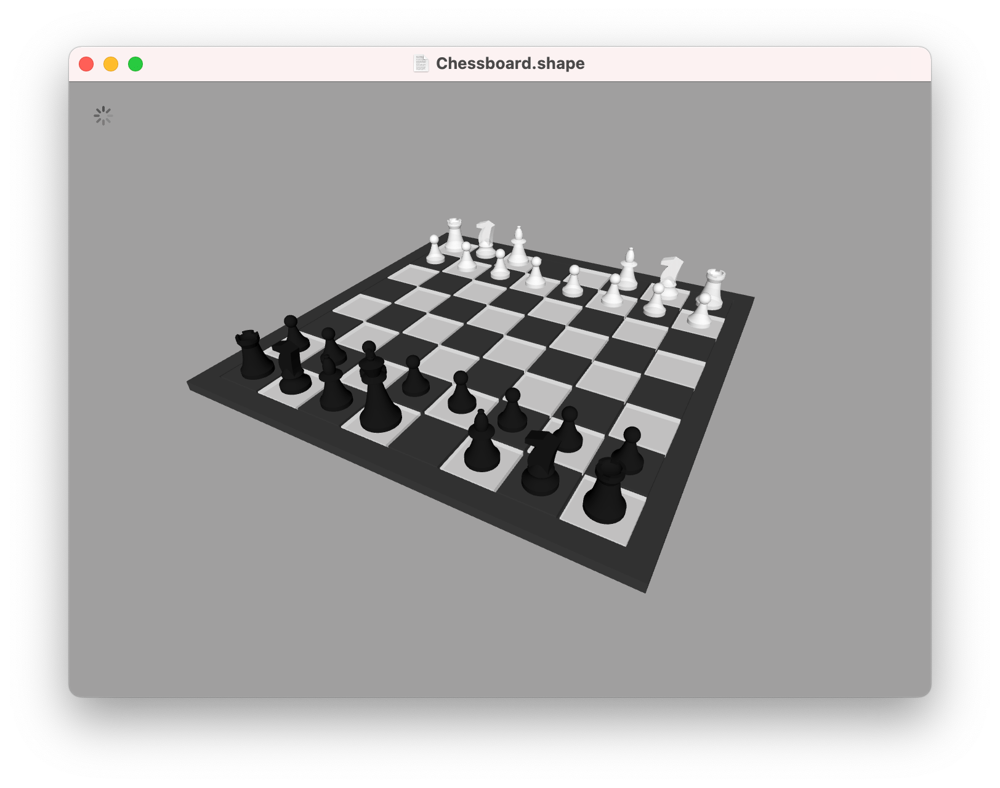
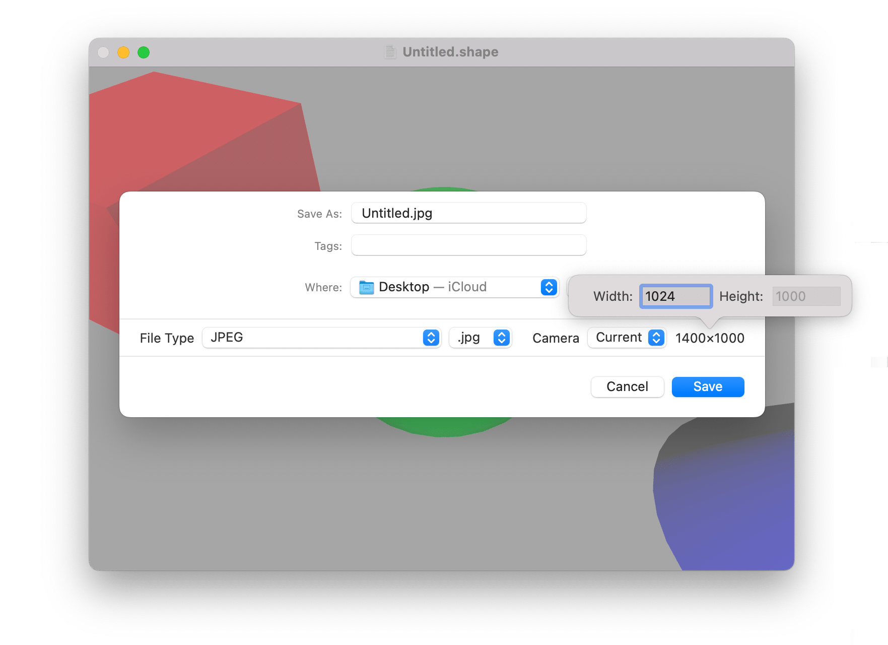

Export
---

Once you've finished crafting your 3D scene, you'll probably want to *do something* with it. For that you will need to use the *Export* feature.

**Export is a paid upgrade that can be unlocked via in-app purchase in the [ShapeScript Mac App](https://apps.apple.com/app/id1441135869). Export is not available in the free ShapesScript Viewer.**

To export your scene, select the `File > Unlock Export Feature…`  menu (**Cmd-Shift-E**) to unlock the export functionality. Once unlocked, this menu will change to `Export…`.

**Note:** If the `Export…` menu is grayed-out, it is most likely because your scene is still loading. Wait for the loading spinner in the top-left of the ShapeScript document window to finish before trying to export.

## Export Formats

ShapeScript can export your scene in a variety of formats, selectable from the export window:

Extension             | File Type                                        | Supports All Features
:-------------------- | :------------------------------------------------|:------------------------------
abc                   | Alembic                                          | No 
dae                   | Collada DAE                                      | Yes
obj                   | Wavefront Object                                 | No
scn / scnz            | SceneKit Scene Document                          | Yes
usd / usdz            | Universal Scene Description                      | No
ply                   | Polygon File Format                              | No
stl / stla            | Stereolithography                                | No
3mf                   | 3D Manufacturing Format                          | No
svg                   | Scalable Vector Graphics                         | No

 

**Note:** Not all formats support all features of ShapeScript scenes, so you may need to experiment. In general, DAE is the most reliable, widely-supported format to use.

Some model formats do not support embedding geometry and textures or materials in a single file; In this case, ShapeScript will export a folder containing the model and associated assets as separate files.

Exported models can be used in a variety of ways:

## Games and AR

Models exported from ShapeScript are well-suited to use in realtime 3D because the `detail` command gives you fine control over the triangle count. For realtime use you should generally set the detail level as low as you can get away with.

You can import DAE files into a game development tool like Unity, or use USD(Z) files with Apple's SceneKit and RealityKit frameworks in Xcode.

## 3D Printing

ShapeScript can export models in the 3D Manufacturing Format (3MF) and Stereolithography (STL) format used by many 3D printing applications. Both binary and ASCII STL files are supported, but binary is recommended for file size and compatibility reasons. To export as ASCII use the `.stla` file extension, but note that you may need to rename the extension to `.stl` for it to be recognized by some applications.

When exporting for 3D printing, you will usually want to avoid having internal geometry inside the outer surface of your model. A good way to do this is to use the [union](csg.md#union) command to combine overlapping parts of your model into a single shape, eliminating internal faces.

ShapeScript scenes use the "Y-up" convention, where the Y-axis points up and the Z-axis points out from the screen. Some popular 3D printing applications such as [Cura](https://ultimaker.com/software/ultimaker-cura) use the "Z-up" convention instead. Check the "Convert to Z-Up" option in the export window to export your model in this orientation.

## Plotters and CNC Machines

By selecting the SVG option, you can export your model as a 2D cross-section. Unlike the other model export formats, the SVG export option does not preserve any depth or material information, but simply takes a slice across the XY plane and captures a vector outline suitable for printing or carving by a [plotter](https://en.wikipedia.org/wiki/Plotter) or [CNC machine](https://en.wikipedia.org/wiki/Numerical_control).

## Image Formats

In addition to 3D models and 2D vector paths, ShapeScript can also export bitmap images. By default, images will be captured using the current camera, but you can select a different [camera view](cameras.md) from the export window. 

The following image formats are supported:

Extension             | File Type                                         | Supports Transparency
:---------------------| :-------------------------------------------------|:------------------------------
gif                   | Graphics Interchange Format                       | Yes
png                   | Portable Network Graphics                         | Yes
jpg / jpeg            | Joint Photographic Experts Group                  | No
jpf / jp2             | JPEG 2000                                         | Yes
tif / tiff            | Tagged Image File Format                          | Yes 
bmp                   | Bitmap                                            | No

 

If you aren't sure which format to use, the PNG format is a good all-rounder, with lossless compression and transparency support.

## Image Options

The size of the exported image defaults to the current window size at the current display resolution. You can override this size in your script file by adding `width` and/or `height` options to your [custom camera](cameras.md#pixel-dimensions), or by clicking on the size label in the export window and selecting a different size:

Images are exported with a transparent background by default if the selected format supports it, or white otherwise. To change the background color or set a background image, you can use the [background command](commands.md#background). If you are planning to composite the image onto a different background later, you may wish to disable [antialiasing](cameras.md#antialiasing).

When exporting an image (or exporting a model for non-realtime use) you can improve the quality by using the `detail` command. A detail level of 100 should be good enough for even a very large or high-resolution image, but this can take a long time to generate/render.

**Note:** Although ShapeScript can export images, for best results you should export as a 3D model and then import that into a [ray tracing](https://en.wikipedia.org/wiki/Ray_tracing_(graphics)) program that provides fine-grained control over scene lighting and camera placement.

---
[Index](index.md) | Next: [Examples](examples.md)
